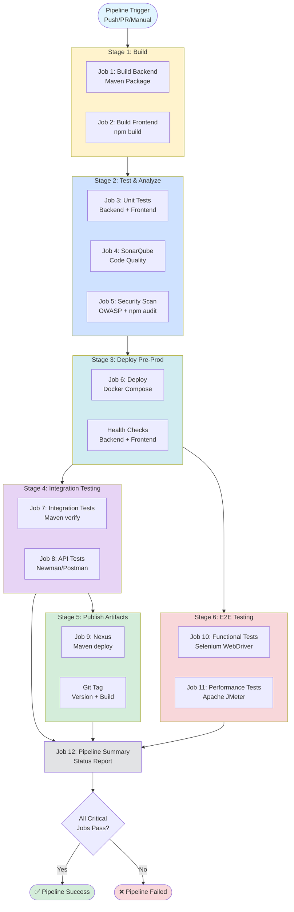
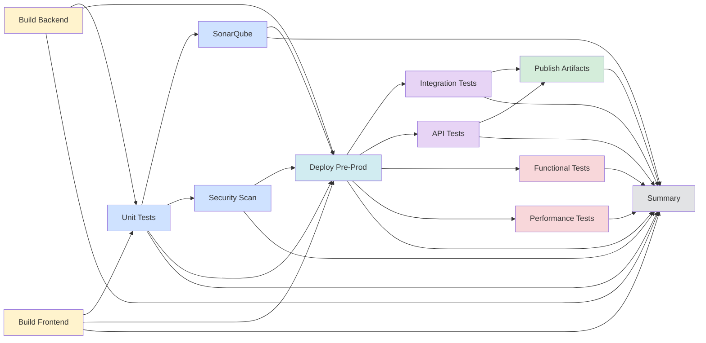
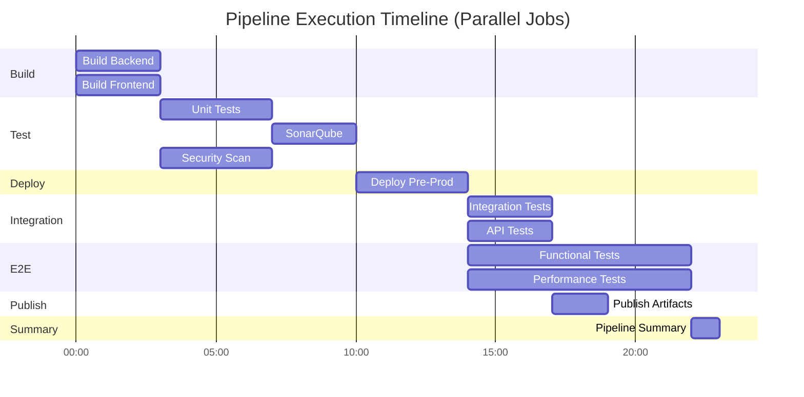
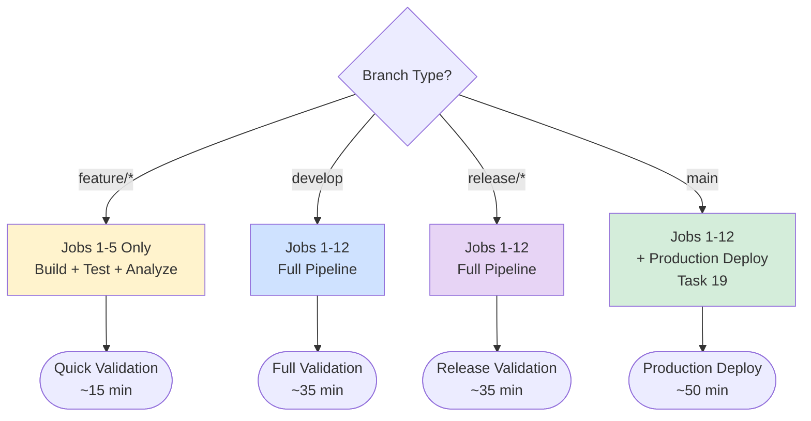
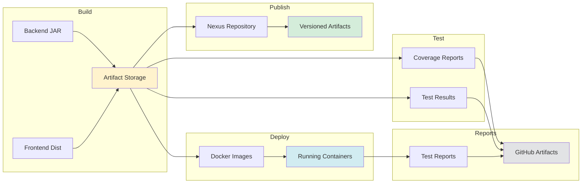
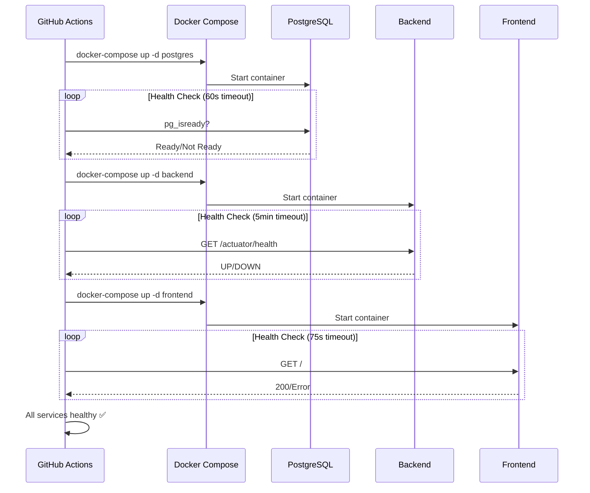
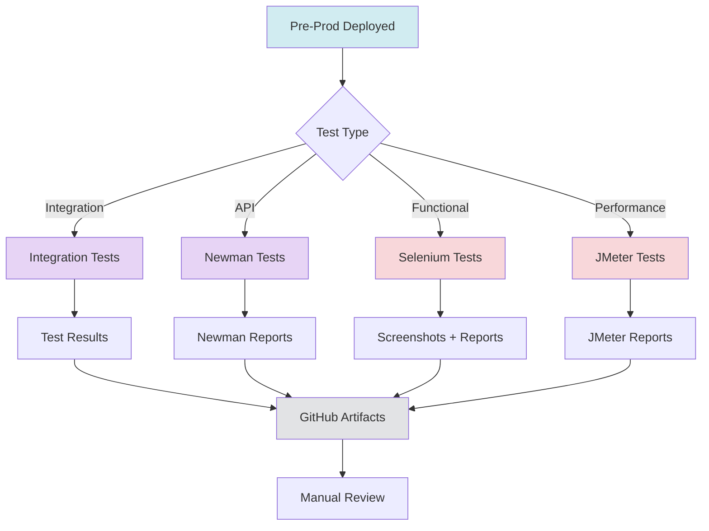
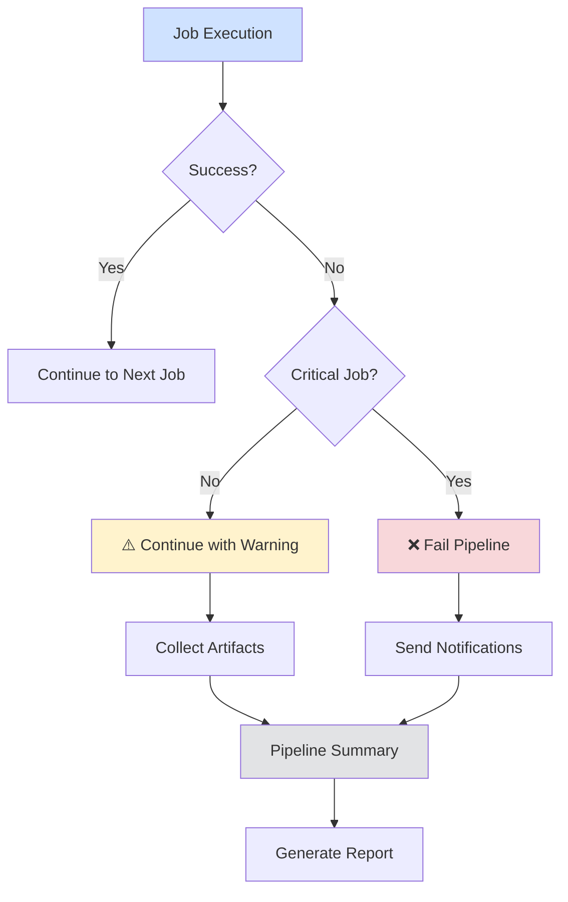
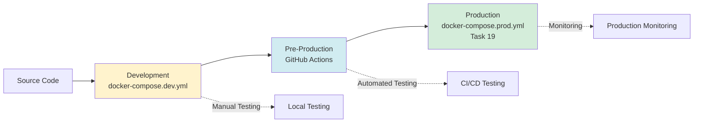

# CI/CD Pipeline Architecture Diagram

## Complete Pipeline Flow (Part 1 + Part 2)



## Job Dependencies



## Parallel Execution Strategy



## Branch-Specific Behavior



## Artifact Flow



## Health Check Flow



## Test Execution Flow



## Error Handling Flow



## Critical vs Non-Critical Jobs

### Critical Jobs (Pipeline fails if these fail)
```
✅ Job 1: Build Backend
✅ Job 2: Build Frontend
✅ Job 3: Unit Tests
✅ Job 4: SonarQube Analysis
✅ Job 5: Security Scan
✅ Job 6: Deploy Pre-Prod
```

### Non-Critical Jobs (Pipeline continues with warnings)
```
⚠️ Job 7: Integration Tests
⚠️ Job 8: API Tests
⚠️ Job 9: Publish Artifacts
⚠️ Job 10: Functional Tests
⚠️ Job 11: Performance Tests
```

## Deployment Environments



## Legend

- 🟨 **Yellow** - Build Stage
- 🟦 **Blue** - Test & Analysis Stage
- 🟩 **Cyan** - Deployment Stage
- 🟪 **Purple** - Integration Testing Stage
- 🟩 **Green** - Artifact Publishing Stage
- 🟥 **Red** - E2E Testing Stage
- ⬜ **Gray** - Summary & Reporting Stage

## Notes

1. **Parallel Execution**: Jobs within the same stage run in parallel when possible
2. **Fail Fast**: Critical jobs stop the pipeline immediately on failure
3. **Continue on Error**: Non-critical test jobs continue to collect all results
4. **Artifact Retention**: All artifacts are kept for 7 days
5. **Health Checks**: All services have retry logic with timeouts
6. **Manual Triggers**: Pipeline can be triggered manually with custom parameters
