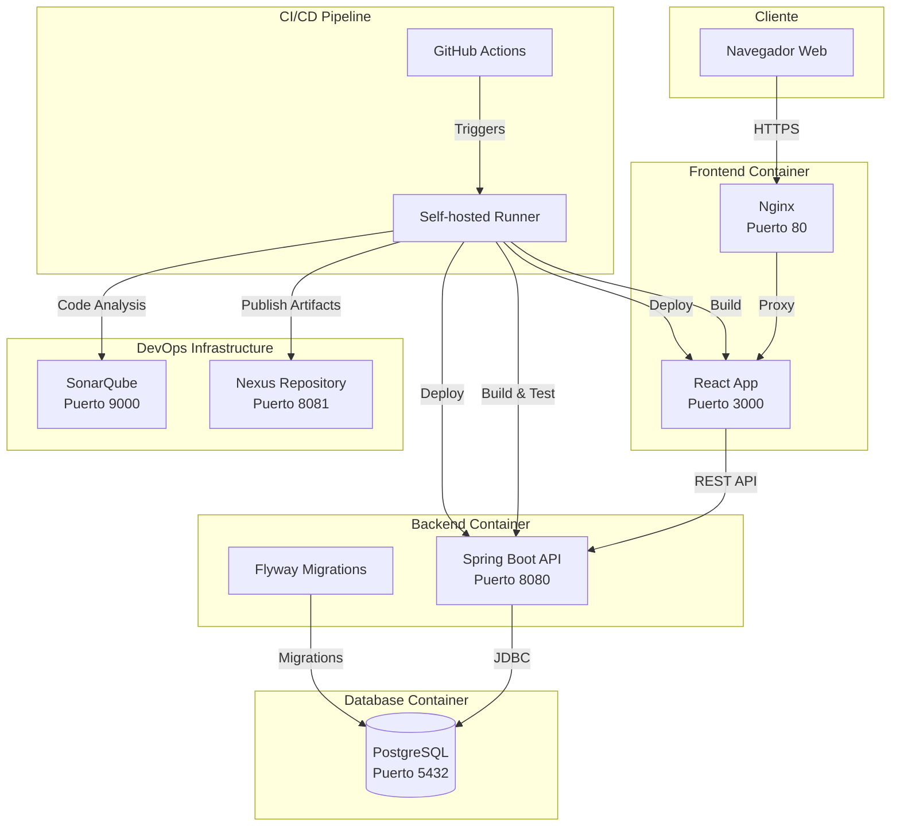
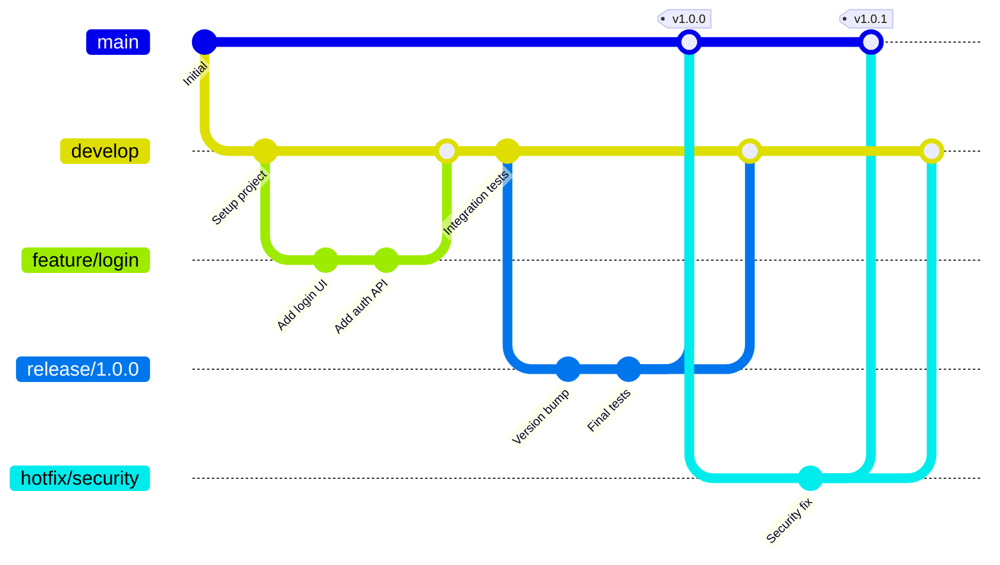
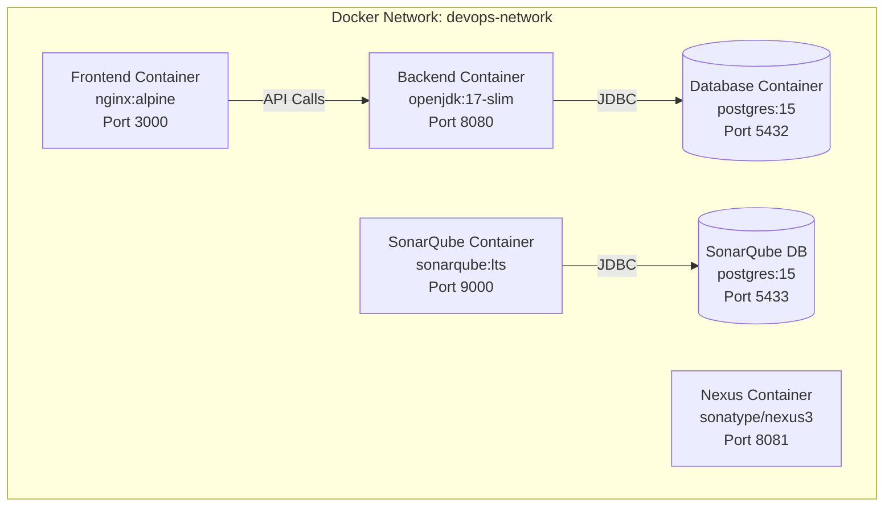
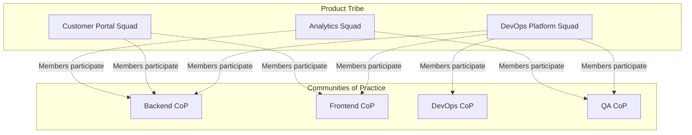

# Design Document - DevOps Enterprise Platform

## Organization Introduction

### About TechCorp Solutions

**TechCorp Solutions** es una empresa ficticia de desarrollo de software fundada en 2015, con sede en Madrid, España. La empresa se especializa en crear soluciones empresariales personalizadas para clientes en los sectores de finanzas, retail y logística. Con un equipo de 50 empleados, TechCorp ha crecido constantemente pero enfrenta desafíos significativos en su proceso de entrega de software.

### Current Organizational Structure (Before DevOps)

**Estructura Tradicional:**
- **Departamento de Desarrollo (20 personas):** Dividido en equipos por tecnología (Backend, Frontend, Mobile)
- **Departamento de Operaciones (8 personas):** Responsable de infraestructura, despliegues y monitoreo
- **Departamento de QA (6 personas):** Testing manual y automatización limitada
- **Departamento de Seguridad (3 personas):** Auditorías de seguridad trimestrales
- **Project Managers (5 personas):** Coordinación entre departamentos

**Problemas Identificados:**
1. **Silos Organizacionales:** Comunicación limitada entre Dev, Ops y QA
2. **Procesos Manuales:** Despliegues manuales propensos a errores
3. **Ciclos Largos:** 6-8 semanas desde código hasta producción
4. **Baja Frecuencia de Deploy:** Solo 1 deploy cada 6 semanas
5. **Alta Tasa de Fallos:** 25% de deploys causan incidentes
6. **Falta de Visibilidad:** No hay métricas claras de rendimiento del proceso

### The Process to Improve

**Proceso Actual de Desarrollo y Despliegue (Waterfall-ish):**

1. **Fase de Requerimientos (1-2 semanas):**
   - Product Manager recopila requerimientos
   - Documentación extensa en Word/Excel
   - Aprobaciones múltiples
   - **Problema:** Requerimientos cambian pero documentación no se actualiza

2. **Fase de Diseño (1 semana):**
   - Arquitecto crea diseño técnico
   - Revisiones en reuniones largas
   - **Problema:** Diseño desconectado de implementación real

3. **Fase de Desarrollo (3-4 semanas):**
   - Developers trabajan en branches de larga duración
   - Poca comunicación con Ops sobre requisitos de infraestructura
   - **Problema:** Integración tardía causa conflictos masivos

4. **Fase de Testing Manual (1-2 semanas):**
   - QA recibe código "completo"
   - Testing manual extensivo
   - Bugs reportados en Jira, developers ya en otro proyecto
   - **Problema:** Feedback loop muy largo, context switching

5. **Fase de Aprobación (3-5 días):**
   - Múltiples aprobaciones requeridas
   - Reuniones de "go/no-go"
   - **Problema:** Burocracia innecesaria

6. **Fase de Despliegue (1-2 días):**
   - Ops recibe "paquete" para desplegar
   - Despliegue manual siguiendo runbook
   - Ventana de despliegue: Viernes 11pm-2am
   - **Problema:** Despliegues nocturnos, errores frecuentes, rollbacks manuales

7. **Post-Despliegue:**
   - Monitoreo reactivo
   - Incidentes descubiertos por usuarios
   - **Problema:** No hay observabilidad proactiva

**Métricas del Proceso Actual:**
- **Lead Time:** 40 días promedio
- **Deployment Frequency:** 1 cada 6 semanas
- **Change Failure Rate:** 25%
- **Mean Time to Recovery (MTTR):** 4 horas
- **Developer Satisfaction:** 5/10 (encuesta interna)
- **Customer Satisfaction:** 6/10

**Pain Points Específicos:**
- Developers frustrados por deploys lentos y feedback tardío
- Ops sobrecargado con despliegues manuales y apagando fuegos
- QA es cuello de botella, siempre bajo presión
- Management no tiene visibilidad del progreso real
- Clientes insatisfechos con tiempo de entrega de features

### The DevOps Transformation Vision

**Objetivo:** Transformar TechCorp Solutions de una organización tradicional con silos a una cultura DevOps colaborativa, automatizada y orientada a la entrega continua de valor.

**Metas Específicas:**
1. **Reducir Lead Time:** De 40 días a <5 días
2. **Aumentar Deployment Frequency:** De 1 cada 6 semanas a múltiples por día
3. **Reducir Change Failure Rate:** De 25% a <5%
4. **Reducir MTTR:** De 4 horas a <30 minutos
5. **Mejorar Satisfacción:** Developers y clientes >8/10

**Enfoque de Implementación:**
- Adoptar cultura DevOps con squads cross-funcionales
- Automatizar todo el pipeline de CI/CD
- Implementar Infrastructure as Code
- Establecer métricas y observabilidad
- Fomentar mejora continua

## Overview

La plataforma DevOps empresarial para TechCorp Solutions es un sistema completo que implementa las mejores prácticas de DevOps, incluyendo una aplicación web full-stack, pipeline CI/CD automatizado, y infraestructura contenerizada. El sistema está diseñado para demostrar la transformación digital de una organización tradicional hacia una cultura DevOps madura.

### Objetivos del Sistema

1. Proporcionar una aplicación web funcional con autenticación y operaciones CRUD
2. Implementar un pipeline CI/CD completo con múltiples stages de validación
3. Automatizar pruebas en todos los niveles (unitarias, integración, funcionales, rendimiento)
4. Garantizar calidad de código mediante análisis estático y cobertura de pruebas
5. Contenerizar toda la infraestructura para portabilidad y consistencia
6. Documentar el proceso de transformación DevOps con VSM y evaluación de madurez

### Stack Tecnológico

**Backend:**
- Lenguaje: Java 17
- Framework: Spring Boot 3.x
- Build Tool: Maven
- Base de Datos: PostgreSQL 15
- Migración DB: Flyway
- Testing: JUnit 5, Mockito, REST Assured

**Frontend:**
- Framework: React 18 con TypeScript
- Build Tool: Vite
- UI Library: Material-UI (MUI)
- State Management: React Context API
- Testing: Vitest, React Testing Library

**DevOps Tools:**
- CI/CD: GitHub Actions
- Análisis de Código: SonarQube
- Gestión de Artefactos: Nexus Repository Manager OSS
- Contenerización: Docker & Docker Compose
- Pruebas API: Postman + Newman
- Pruebas Funcionales: Selenium WebDriver
- Pruebas de Rendimiento: Apache JMeter

## Architecture

### Arquitectura General del Sistema



### Estrategia de Branching - Git Flow

El proyecto utilizará Git Flow como estrategia de branching:

**Ramas Principales:**
- `main` (también llamada `master` o `production`): Código en producción, siempre estable y desplegable
- `develop` (también llamada `development`): Rama de integración para desarrollo activo

**Ramas de Soporte:**
- `feature/*`: Nuevas funcionalidades (ej: `feature/user-authentication`)
- `release/*`: Preparación de releases (ej: `release/1.0.0`)
- `hotfix/*`: Correcciones urgentes en producción (ej: `hotfix/security-patch`)

**Aclaración Importante:**
- La rama `main` representa el entorno de **PRODUCCIÓN**
- La rama `develop` representa el entorno de **DESARROLLO**
- No existe una rama separada llamada "producción" - `main` cumple ese rol

**Flujo de Trabajo:**



**Mapeo Rama-Entorno:**
- `feature/*` → Entorno de desarrollo local (máquina del desarrollador)
- `develop` → Entorno de desarrollo compartido (servidor de desarrollo)
- `release/*` → Entorno de pre-producción / staging
- `main` → Entorno de PRODUCCIÓN (servidor de producción)

**Nota:** En Git Flow, `main` es la rama de producción. Cada commit en `main` representa una versión que está o estará en producción. Por eso `main` siempre debe estar estable y lista para desplegar.

**Políticas de Protección:**
- `main` y `develop` requieren pull request con al menos 1 aprobación
- `main` requiere que todos los checks del pipeline pasen
- No se permiten commits directos a `main` o `develop`
- Los merges a `main` deben ser fast-forward o merge commits

### Arquitectura de Red y Puertos

| Servicio | Puerto Interno | Puerto Expuesto | Protocolo |
|----------|---------------|-----------------|-----------|
| Frontend (Nginx) | 80 | 3000 | HTTP |
| Backend (Spring Boot) | 8080 | 8080 | HTTP |
| PostgreSQL | 5432 | 5432 | TCP |
| SonarQube | 9000 | 9000 | HTTP |
| Nexus | 8081 | 8081 | HTTP |

**Comunicación entre Servicios:**
- Frontend → Backend: REST API sobre HTTP
- Backend → Database: JDBC sobre TCP
- Pipeline → SonarQube: REST API sobre HTTP
- Pipeline → Nexus: Maven Deploy Protocol

## Components and Interfaces

### Backend Components

#### 1. Authentication Module
**Responsabilidad:** Gestionar autenticación y autorización de usuarios

**Componentes:**
- `AuthController`: Endpoints de login/logout
- `AuthService`: Lógica de autenticación
- `JwtTokenProvider`: Generación y validación de tokens JWT
- `UserDetailsServiceImpl`: Carga de detalles de usuario
- `SecurityConfig`: Configuración de Spring Security

**Endpoints:**
```
POST /api/auth/login
  Request: { "username": string, "password": string }
  Response: { "token": string, "user": UserDTO }

POST /api/auth/logout
  Request: { "token": string }
  Response: { "message": string }

GET /api/auth/validate
  Headers: Authorization: Bearer <token>
  Response: { "valid": boolean, "user": UserDTO }
```

#### 2. CRUD Module (Employees)
**Responsabilidad:** Gestionar operaciones CRUD sobre entidad Employee

**Componentes:**
- `EmployeeController`: Endpoints REST para empleados
- `EmployeeService`: Lógica de negocio
- `EmployeeRepository`: Acceso a datos (JPA)
- `EmployeeValidator`: Validaciones de negocio
- `Employee`: Entidad JPA

**Endpoints:**
```
GET /api/employees
  Response: List<EmployeeDTO>

GET /api/employees/{id}
  Response: EmployeeDTO

POST /api/employees
  Request: EmployeeCreateDTO
  Response: EmployeeDTO

PUT /api/employees/{id}
  Request: EmployeeUpdateDTO
  Response: EmployeeDTO

DELETE /api/employees/{id}
  Response: { "message": string }
```

#### 3. Database Migration Module
**Responsabilidad:** Gestionar versionado y migración de esquema de base de datos

**Componentes:**
- Flyway configurado en `application.properties`
- Scripts de migración en `src/main/resources/db/migration/`
- Naming convention: `V{version}__{description}.sql`

**Ejemplo de Migraciones:**
```
V1__create_users_table.sql
V2__create_employees_table.sql
V3__add_employee_status_column.sql
```

### Frontend Components

#### 1. Authentication Components
- `LoginPage`: Página de inicio de sesión
- `AuthContext`: Context API para estado de autenticación
- `PrivateRoute`: HOC para proteger rutas
- `useAuth`: Custom hook para acceder a autenticación

#### 2. Employee Management Components
- `EmployeeListPage`: Tabla con listado de empleados
- `EmployeeFormPage`: Formulario para crear/editar empleados
- `EmployeeTable`: Componente de tabla con ordenamiento y paginación
- `EmployeeForm`: Formulario con validaciones

**Controles de UI en EmployeeForm:**
- Radio buttons: Género (Masculino/Femenino/Otro)
- Checkboxes: Habilidades técnicas (Java, Python, React, etc.)
- Combobox: Departamento (IT, HR, Finance, Sales)
- Combobox: Nivel (Junior, Mid, Senior, Lead)
- Input text: Nombre, Email, Teléfono
- Date picker: Fecha de contratación

#### 3. Shared Components
- `Layout`: Layout principal con navegación
- `Navbar`: Barra de navegación
- `LoadingSpinner`: Indicador de carga
- `ErrorBoundary`: Manejo de errores
- `Toast`: Notificaciones

### API Client Layer

**Axios Configuration:**
```typescript
// api/client.ts
const apiClient = axios.create({
  baseURL: process.env.VITE_API_URL || 'http://localhost:8080/api',
  timeout: 10000,
  headers: {
    'Content-Type': 'application/json'
  }
});

// Interceptor para agregar token JWT
apiClient.interceptors.request.use((config) => {
  const token = localStorage.getItem('token');
  if (token) {
    config.headers.Authorization = `Bearer ${token}`;
  }
  return config;
});
```

## Data Models

### Backend Entities

#### User Entity
```java
@Entity
@Table(name = "users")
public class User {
    @Id
    @GeneratedValue(strategy = GenerationType.IDENTITY)
    private Long id;
    
    @Column(unique = true, nullable = false)
    private String username;
    
    @Column(nullable = false)
    private String password; // BCrypt hashed
    
    @Column(nullable = false)
    private String email;
    
    @Enumerated(EnumType.STRING)
    private Role role; // ADMIN, USER
    
    @Column(name = "created_at")
    private LocalDateTime createdAt;
    
    @Column(name = "last_login")
    private LocalDateTime lastLogin;
    
    private boolean active;
}
```

#### Employee Entity
```java
@Entity
@Table(name = "employees")
public class Employee {
    @Id
    @GeneratedValue(strategy = GenerationType.IDENTITY)
    private Long id;
    
    @Column(nullable = false)
    private String firstName;
    
    @Column(nullable = false)
    private String lastName;
    
    @Column(unique = true, nullable = false)
    private String email;
    
    private String phone;
    
    @Enumerated(EnumType.STRING)
    private Gender gender; // MALE, FEMALE, OTHER
    
    @Enumerated(EnumType.STRING)
    private Department department; // IT, HR, FINANCE, SALES
    
    @Enumerated(EnumType.STRING)
    private Level level; // JUNIOR, MID, SENIOR, LEAD
    
    @ElementCollection
    @CollectionTable(name = "employee_skills")
    private Set<String> skills;
    
    @Column(name = "hire_date")
    private LocalDate hireDate;
    
    @Column(name = "created_at")
    private LocalDateTime createdAt;
    
    @Column(name = "updated_at")
    private LocalDateTime updatedAt;
}
```

### Frontend Types

```typescript
// types/auth.ts
export interface User {
  id: number;
  username: string;
  email: string;
  role: 'ADMIN' | 'USER';
}

export interface LoginRequest {
  username: string;
  password: string;
}

export interface AuthResponse {
  token: string;
  user: User;
}

// types/employee.ts
export interface Employee {
  id: number;
  firstName: string;
  lastName: string;
  email: string;
  phone?: string;
  gender: 'MALE' | 'FEMALE' | 'OTHER';
  department: 'IT' | 'HR' | 'FINANCE' | 'SALES';
  level: 'JUNIOR' | 'MID' | 'SENIOR' | 'LEAD';
  skills: string[];
  hireDate: string;
  createdAt: string;
  updatedAt: string;
}

export interface EmployeeFormData {
  firstName: string;
  lastName: string;
  email: string;
  phone?: string;
  gender: string;
  department: string;
  level: string;
  skills: string[];
  hireDate: string;
}
```

### Database Schema

```sql
-- V1__create_users_table.sql
CREATE TABLE users (
    id BIGSERIAL PRIMARY KEY,
    username VARCHAR(50) UNIQUE NOT NULL,
    password VARCHAR(255) NOT NULL,
    email VARCHAR(100) NOT NULL,
    role VARCHAR(20) NOT NULL,
    created_at TIMESTAMP DEFAULT CURRENT_TIMESTAMP,
    last_login TIMESTAMP,
    active BOOLEAN DEFAULT true
);

-- V2__create_employees_table.sql
CREATE TABLE employees (
    id BIGSERIAL PRIMARY KEY,
    first_name VARCHAR(100) NOT NULL,
    last_name VARCHAR(100) NOT NULL,
    email VARCHAR(100) UNIQUE NOT NULL,
    phone VARCHAR(20),
    gender VARCHAR(10) NOT NULL,
    department VARCHAR(20) NOT NULL,
    level VARCHAR(20) NOT NULL,
    hire_date DATE NOT NULL,
    created_at TIMESTAMP DEFAULT CURRENT_TIMESTAMP,
    updated_at TIMESTAMP DEFAULT CURRENT_TIMESTAMP
);

CREATE TABLE employee_skills (
    employee_id BIGINT REFERENCES employees(id) ON DELETE CASCADE,
    skills VARCHAR(50),
    PRIMARY KEY (employee_id, skills)
);

CREATE INDEX idx_employees_email ON employees(email);
CREATE INDEX idx_employees_department ON employees(department);
```


## Correctness Properties

*A property is a characteristic or behavior that should hold true across all valid executions of a system-essentially, a formal statement about what the system should do. Properties serve as the bridge between human-readable specifications and machine-verifiable correctness guarantees.*

### Property 1: Valid credentials authenticate successfully
*For any* user with valid credentials stored in the database, when those credentials are provided to the login endpoint, the system should return a valid JWT token and user information.
**Validates: Requirements 1.1**

### Property 2: Invalid credentials are rejected
*For any* credentials that do not match a user in the database, when those credentials are provided to the login endpoint, the system should return an authentication error and not issue a token.
**Validates: Requirements 1.2**

### Property 3: Protected resources require valid authentication
*For any* protected API endpoint, when accessed without a valid JWT token, the system should return a 401 Unauthorized response.
**Validates: Requirements 1.3**

### Property 4: Logout invalidates session
*For any* active user session, when the logout endpoint is called with that session's token, subsequent requests using that token should be rejected as unauthorized.
**Validates: Requirements 1.4**

### Property 5: Passwords are securely hashed
*For any* user created in the system, the password stored in the database should be hashed using BCrypt and should not match the plaintext password.
**Validates: Requirements 1.5**

### Property 6: CRUD consistency - Create and Read
*For any* valid employee data, when a create operation is performed, a subsequent read operation should return an employee with the same data.
**Validates: Requirements 2.1, 2.2**

### Property 7: CRUD consistency - Update
*For any* existing employee and valid update data, when an update operation is performed, a subsequent read operation should return the employee with the updated data.
**Validates: Requirements 2.3**

### Property 8: CRUD consistency - Delete
*For any* existing employee, when a delete operation is performed, subsequent read operations should not return that employee.
**Validates: Requirements 2.4**

### Property 9: Invalid data is rejected
*For any* employee data that violates validation rules (missing required fields, invalid email format, etc.), create and update operations should reject the data and return validation errors.
**Validates: Requirements 2.5**

### Property 10: UI validation provides feedback
*For any* form input control, when invalid data is entered, the system should display validation feedback before form submission.
**Validates: Requirements 3.5**

### Property 11: Pending migrations execute on startup
*For any* set of pending Flyway migrations, when the application starts, all pending migrations should be executed in version order and recorded in the flyway_schema_history table.
**Validates: Requirements 5.2**

### Property 12: Failed migrations preserve schema integrity
*For any* invalid migration script, when Flyway attempts to execute it, the migration should fail, the error should be reported, and the database schema should remain in its pre-migration state.
**Validates: Requirements 5.4**

### Property 13: Artifacts have semantic versioning
*For any* artifact published to Nexus, the version number should follow semantic versioning format (MAJOR.MINOR.PATCH) or include SNAPSHOT suffix for development builds.
**Validates: Requirements 9.2**

### Property 14: Pipeline fails fast on stage failure
*For any* stage in the CI/CD pipeline, when that stage fails, the pipeline should immediately stop execution and not proceed to subsequent stages.
**Validates: Requirements 12.2**


## Error Handling

### Backend Error Handling Strategy

**Global Exception Handler:**
```java
@RestControllerAdvice
public class GlobalExceptionHandler {
    
    @ExceptionHandler(EntityNotFoundException.class)
    public ResponseEntity<ErrorResponse> handleNotFound(EntityNotFoundException ex) {
        return ResponseEntity.status(HttpStatus.NOT_FOUND)
            .body(new ErrorResponse("NOT_FOUND", ex.getMessage()));
    }
    
    @ExceptionHandler(ValidationException.class)
    public ResponseEntity<ErrorResponse> handleValidation(ValidationException ex) {
        return ResponseEntity.status(HttpStatus.BAD_REQUEST)
            .body(new ErrorResponse("VALIDATION_ERROR", ex.getMessage(), ex.getErrors()));
    }
    
    @ExceptionHandler(AuthenticationException.class)
    public ResponseEntity<ErrorResponse> handleAuth(AuthenticationException ex) {
        return ResponseEntity.status(HttpStatus.UNAUTHORIZED)
            .body(new ErrorResponse("UNAUTHORIZED", ex.getMessage()));
    }
    
    @ExceptionHandler(Exception.class)
    public ResponseEntity<ErrorResponse> handleGeneral(Exception ex) {
        log.error("Unexpected error", ex);
        return ResponseEntity.status(HttpStatus.INTERNAL_SERVER_ERROR)
            .body(new ErrorResponse("INTERNAL_ERROR", "An unexpected error occurred"));
    }
}
```

**Error Response Format:**
```json
{
  "code": "VALIDATION_ERROR",
  "message": "Invalid employee data",
  "errors": [
    {
      "field": "email",
      "message": "Email format is invalid"
    }
  ],
  "timestamp": "2024-01-15T10:30:00Z"
}
```

### Frontend Error Handling Strategy

**API Error Interceptor:**
```typescript
apiClient.interceptors.response.use(
  (response) => response,
  (error) => {
    if (error.response?.status === 401) {
      // Redirect to login
      localStorage.removeItem('token');
      window.location.href = '/login';
    }
    
    if (error.response?.status === 403) {
      toast.error('You do not have permission to perform this action');
    }
    
    if (error.response?.status >= 500) {
      toast.error('Server error. Please try again later');
    }
    
    return Promise.reject(error);
  }
);
```

**Form Validation:**
- Client-side validation using React Hook Form with Yup schema
- Real-time validation feedback
- Server-side validation errors displayed in form

### Database Error Handling

- Flyway migration failures logged and prevent application startup
- Database connection failures trigger retry logic with exponential backoff
- Transaction rollback on any error during multi-step operations
- Constraint violations mapped to user-friendly validation messages

### Pipeline Error Handling

- Each stage has explicit error handling and logging
- Failed stages trigger notifications to team channels
- Rollback procedures for failed deployments
- Artifact cleanup on build failures


## Testing Strategy

### Overview

El proyecto implementa una estrategia de testing integral que combina múltiples niveles de pruebas para garantizar la calidad y correctness del sistema. La estrategia incluye tanto pruebas unitarias tradicionales como property-based testing para validar las propiedades de correctness definidas.

### Unit Testing

**Backend Unit Tests (JUnit 5 + Mockito):**

**Cobertura Objetivo:** >80% de cobertura de código

**Áreas de Enfoque:**
- Controllers: Validar que los endpoints manejan correctamente requests y responses
- Services: Probar lógica de negocio y validaciones
- Repositories: Verificar queries personalizadas
- Security: Probar autenticación y autorización
- Validators: Validar reglas de negocio

**Ejemplo de Test Unitario:**
```java
@SpringBootTest
class EmployeeServiceTest {
    
    @Mock
    private EmployeeRepository repository;
    
    @InjectMocks
    private EmployeeService service;
    
    @Test
    void createEmployee_WithValidData_ShouldPersist() {
        // Arrange
        EmployeeCreateDTO dto = new EmployeeCreateDTO(/*...*/);
        Employee entity = new Employee(/*...*/);
        when(repository.save(any())).thenReturn(entity);
        
        // Act
        EmployeeDTO result = service.createEmployee(dto);
        
        // Assert
        assertNotNull(result);
        assertEquals(dto.getEmail(), result.getEmail());
        verify(repository).save(any());
    }
    
    @Test
    void createEmployee_WithInvalidEmail_ShouldThrowValidationException() {
        // Arrange
        EmployeeCreateDTO dto = new EmployeeCreateDTO();
        dto.setEmail("invalid-email");
        
        // Act & Assert
        assertThrows(ValidationException.class, () -> service.createEmployee(dto));
    }
}
```

**Frontend Unit Tests (Vitest + React Testing Library):**

**Áreas de Enfoque:**
- Components: Renderizado y comportamiento de UI
- Hooks: Lógica de custom hooks
- Utils: Funciones de utilidad
- API Client: Manejo de requests y responses

**Ejemplo de Test Unitario:**
```typescript
describe('EmployeeForm', () => {
  it('should display validation errors for invalid email', async () => {
    render(<EmployeeForm />);
    
    const emailInput = screen.getByLabelText(/email/i);
    await userEvent.type(emailInput, 'invalid-email');
    await userEvent.tab();
    
    expect(await screen.findByText(/invalid email format/i)).toBeInTheDocument();
  });
  
  it('should submit form with valid data', async () => {
    const onSubmit = vi.fn();
    render(<EmployeeForm onSubmit={onSubmit} />);
    
    await userEvent.type(screen.getByLabelText(/first name/i), 'John');
    await userEvent.type(screen.getByLabelText(/last name/i), 'Doe');
    await userEvent.type(screen.getByLabelText(/email/i), 'john@example.com');
    
    await userEvent.click(screen.getByRole('button', { name: /submit/i }));
    
    expect(onSubmit).toHaveBeenCalledWith(expect.objectContaining({
      firstName: 'John',
      lastName: 'Doe',
      email: 'john@example.com'
    }));
  });
});
```

### Property-Based Testing

**Framework:** JUnit-Quickcheck para Java

**Configuración:** Cada property test ejecutará un mínimo de 100 iteraciones con datos generados aleatoriamente.

**Tagging Convention:** Cada property-based test DEBE incluir un comentario que referencie explícitamente la propiedad del documento de diseño:
```java
/**
 * Feature: devops-enterprise-platform, Property 6: CRUD consistency - Create and Read
 */
```

**Generadores Personalizados:**
```java
public class EmployeeGenerator extends Generator<Employee> {
    @Override
    public Employee generate(SourceOfRandomness random, GenerationStatus status) {
        return Employee.builder()
            .firstName(random.nextString(5, 20))
            .lastName(random.nextString(5, 20))
            .email(generateValidEmail(random))
            .gender(random.choose(Gender.values()))
            .department(random.choose(Department.values()))
            .level(random.choose(Level.values()))
            .hireDate(generateRandomDate(random))
            .build();
    }
    
    private String generateValidEmail(SourceOfRandomness random) {
        return random.nextString(5, 10) + "@" + random.nextString(5, 10) + ".com";
    }
}
```

**Ejemplo de Property Test:**
```java
@RunWith(JUnitQuickcheck.class)
public class EmployeeCRUDPropertiesTest {
    
    @Autowired
    private EmployeeService service;
    
    /**
     * Feature: devops-enterprise-platform, Property 6: CRUD consistency - Create and Read
     */
    @Property(trials = 100)
    public void createThenRead_ShouldReturnSameData(@From(EmployeeGenerator.class) Employee employee) {
        // Arrange & Act
        EmployeeDTO created = service.createEmployee(toCreateDTO(employee));
        EmployeeDTO retrieved = service.getEmployeeById(created.getId());
        
        // Assert
        assertEquals(created.getEmail(), retrieved.getEmail());
        assertEquals(created.getFirstName(), retrieved.getFirstName());
        assertEquals(created.getLastName(), retrieved.getLastName());
    }
    
    /**
     * Feature: devops-enterprise-platform, Property 9: Invalid data is rejected
     */
    @Property(trials = 100)
    public void createWithInvalidEmail_ShouldReject(@From(InvalidEmailGenerator.class) String invalidEmail) {
        // Arrange
        EmployeeCreateDTO dto = validEmployeeDTO();
        dto.setEmail(invalidEmail);
        
        // Act & Assert
        assertThrows(ValidationException.class, () -> service.createEmployee(dto));
    }
}
```

### Integration Testing

**API Integration Tests (REST Assured):**
- Pruebas end-to-end de los endpoints REST
- Base de datos H2 en memoria para aislamiento
- Validación de contratos de API

**Ejemplo:**
```java
@SpringBootTest(webEnvironment = WebEnvironment.RANDOM_PORT)
class EmployeeAPIIntegrationTest {
    
    @LocalServerPort
    private int port;
    
    @Test
    void createEmployee_ShouldReturn201() {
        given()
            .port(port)
            .contentType(ContentType.JSON)
            .body(validEmployeeJSON())
        .when()
            .post("/api/employees")
        .then()
            .statusCode(201)
            .body("email", equalTo("test@example.com"));
    }
}
```

### API Testing (Postman + Newman)

**Colecciones de Postman:**
- `auth.postman_collection.json`: Tests de autenticación
- `employees.postman_collection.json`: Tests de CRUD de empleados

**Ejecución en Pipeline:**
```bash
newman run postman/employees.postman_collection.json \
  --environment postman/env.json \
  --reporters cli,json \
  --reporter-json-export newman-results.json
```

**Assertions en Postman:**
```javascript
pm.test("Status code is 200", function () {
    pm.response.to.have.status(200);
});

pm.test("Response has correct structure", function () {
    var jsonData = pm.response.json();
    pm.expect(jsonData).to.have.property('id');
    pm.expect(jsonData).to.have.property('email');
    pm.expect(jsonData.email).to.match(/^[\w-\.]+@([\w-]+\.)+[\w-]{2,4}$/);
});
```

### Functional Testing (Selenium)

**Framework:** Selenium WebDriver con Java

**Page Object Pattern:**
```java
public class LoginPage {
    private WebDriver driver;
    
    @FindBy(id = "username")
    private WebElement usernameInput;
    
    @FindBy(id = "password")
    private WebElement passwordInput;
    
    @FindBy(css = "button[type='submit']")
    private WebElement submitButton;
    
    public void login(String username, String password) {
        usernameInput.sendKeys(username);
        passwordInput.sendKeys(password);
        submitButton.click();
    }
}

@Test
public void testLoginFlow() {
    LoginPage loginPage = new LoginPage(driver);
    loginPage.login("admin", "password");
    
    EmployeeListPage employeePage = new EmployeeListPage(driver);
    assertTrue(employeePage.isDisplayed());
}
```

**Screenshot on Failure:**
```java
@AfterMethod
public void takeScreenshotOnFailure(ITestResult result) {
    if (result.getStatus() == ITestResult.FAILURE) {
        File screenshot = ((TakesScreenshot) driver).getScreenshotAs(OutputType.FILE);
        FileUtils.copyFile(screenshot, new File("screenshots/" + result.getName() + ".png"));
    }
}
```

### Performance Testing (JMeter)

**Test Plans:**
- `employee-api-load-test.jmx`: Pruebas de carga en endpoints de empleados
- `auth-stress-test.jmx`: Pruebas de estrés en autenticación

**Configuración:**
- Usuarios concurrentes: 50-100
- Ramp-up period: 30 segundos
- Duración: 5 minutos

**Assertions:**
- Response time < 500ms para el 95% de requests
- Error rate < 1%
- Throughput > 100 requests/segundo

**Ejecución:**
```bash
jmeter -n -t tests/jmeter/employee-api-load-test.jmx \
  -l results.jtl \
  -e -o reports/
```

### Code Quality Analysis (SonarQube)

**Quality Gate Configurado:**
- Coverage: >80%
- Duplications: <3%
- Maintainability Rating: A
- Reliability Rating: A
- Security Rating: A
- Security Hotspots: 0 de alta/crítica
- Bugs: 0 de alta/crítica
- Code Smells: <10 de alta

**Integración en Pipeline:**
```bash
mvn clean verify sonar:sonar \
  -Dsonar.projectKey=devops-enterprise-platform \
  -Dsonar.host.url=http://localhost:9000 \
  -Dsonar.login=$SONAR_TOKEN
```

### Test Execution Strategy

**Local Development:**
1. Unit tests ejecutados en cada commit (pre-commit hook)
2. Integration tests ejecutados antes de push

**CI/CD Pipeline:**
1. Unit tests en stage "Pruebas Unitarias"
2. Integration tests en stage "Pruebas Integrales"
3. API tests (Newman) en stage "Pruebas Integrales"
4. Functional tests (Selenium) en stage "Pruebas Funcionales"
5. Performance tests (JMeter) en stage "Pruebas Rendimiento"
6. Code quality (SonarQube) en stage "Compilar"

**Test Data Management:**
- Datos de prueba generados mediante factories y builders
- Base de datos limpiada entre tests de integración
- Fixtures para casos específicos de prueba


## CI/CD Pipeline Design

### Pipeline Overview

El pipeline CI/CD está implementado en GitHub Actions y sigue un flujo completo desde el código fuente hasta producción, con múltiples stages de validación y testing.

### Pipeline Stages

```mermaid
graph LR
    A[Start] --> B[Checkout Code]
    B --> C[Build Backend]
    C --> D[Build Frontend]
    D --> E[Unit Tests]
    E --> F[SonarQube Analysis]
    F --> G[Security Scan]
    G --> H[Deploy Pre-prod]
    H --> I[Integration Tests]
    I --> J[API Tests Newman]
    J --> K[Publish Artifact]
    K --> L[Functional Tests Selenium]
    L --> M[Performance Tests JMeter]
    M --> N[Publish STABLE]
    N --> O[Canary Deploy]
    O --> P[Health Check]
    P --> Q[Deploy Production]
    Q --> R[Publish GOLD]
    R --> S[Monitoring]
    S --> T[Notifications]
    T --> U[End]
    
    E -.->|Fail| V[Rollback]
    F -.->|Fail| V
    I -.->|Fail| V
    L -.->|Fail| V
    M -.->|Fail| V
    P -.->|Fail| V
```



### Detailed Stage Definitions

#### 1. Start
- Trigger: Push to `main`, `develop`, or `release/*` branches
- También: Manual dispatch con parámetros

#### 2. Checkout Code (Descargar Fuentes)
```yaml
- name: Checkout code
  uses: actions/checkout@v4
  with:
    fetch-depth: 0  # Para SonarQube analysis
```

#### 3. Build Backend (Compilar Backend)
```yaml
- name: Setup Java
  uses: actions/setup-java@v4
  with:
    java-version: '17'
    distribution: 'temurin'

- name: Build with Maven
  run: mvn clean package -DskipTests
  working-directory: ./backend

- name: Upload backend artifact
  uses: actions/upload-artifact@v4
  with:
    name: backend-jar
    path: backend/target/*.jar
```

#### 4. Build Frontend (Compilar Frontend)
```yaml
- name: Setup Node.js
  uses: actions/setup-node@v4
  with:
    node-version: '18'

- name: Install dependencies
  run: npm ci
  working-directory: ./frontend

- name: Build frontend
  run: npm run build
  working-directory: ./frontend

- name: Upload frontend artifact
  uses: actions/upload-artifact@v4
  with:
    name: frontend-dist
    path: frontend/dist/
```

#### 5. Unit Tests (Pruebas Unitarias)
```yaml
- name: Run backend unit tests
  run: mvn test jacoco:report
  working-directory: ./backend

- name: Run frontend unit tests
  run: npm run test:coverage
  working-directory: ./frontend

- name: Upload coverage reports
  uses: actions/upload-artifact@v4
  with:
    name: coverage-reports
    path: |
      backend/target/site/jacoco/
      frontend/coverage/
```

#### 6. SonarQube Analysis
```yaml
- name: SonarQube Scan
  env:
    SONAR_TOKEN: ${{ secrets.SONAR_TOKEN }}
  run: |
    mvn sonar:sonar \
      -Dsonar.projectKey=devops-enterprise-platform \
      -Dsonar.host.url=${{ secrets.SONAR_HOST_URL }} \
      -Dsonar.login=${{ secrets.SONAR_TOKEN }}
  working-directory: ./backend

- name: Check Quality Gate
  run: |
    status=$(curl -s -u ${{ secrets.SONAR_TOKEN }}: \
      "${{ secrets.SONAR_HOST_URL }}/api/qualitygates/project_status?projectKey=devops-enterprise-platform" \
      | jq -r '.projectStatus.status')
    if [ "$status" != "OK" ]; then
      echo "Quality Gate failed"
      exit 1
    fi
```

#### 7. Security Scan (Análisis de Seguridad de Dependencias)
```yaml
- name: Run OWASP Dependency Check
  run: mvn org.owasp:dependency-check-maven:check
  working-directory: ./backend

- name: Run npm audit
  run: npm audit --audit-level=high
  working-directory: ./frontend
```

#### 8. Deploy Pre-production (Habilitar Entorno Pre-producción)
```yaml
- name: Deploy to pre-prod
  run: |
    docker-compose -f docker-compose.preprod.yml down
    docker-compose -f docker-compose.preprod.yml up -d
    
- name: Wait for services
  run: |
    timeout 60 bash -c 'until curl -f http://localhost:8080/actuator/health; do sleep 2; done'
```

#### 9. Integration Tests (Pruebas Integrales)
```yaml
- name: Run integration tests
  run: mvn verify -P integration-tests
  working-directory: ./backend
  env:
    SPRING_PROFILES_ACTIVE: integration
```

#### 10. API Tests with Newman
```yaml
- name: Install Newman
  run: npm install -g newman newman-reporter-htmlextra

- name: Run Postman collections
  run: |
    newman run postman/auth.postman_collection.json \
      --environment postman/preprod.env.json \
      --reporters cli,htmlextra \
      --reporter-htmlextra-export newman-report.html
```

#### 11. Publish Artifact to Nexus (Entregar Artefacto)
```yaml
- name: Publish to Nexus
  run: |
    VERSION=$(mvn help:evaluate -Dexpression=project.version -q -DforceStdout)
    mvn deploy -DskipTests
  working-directory: ./backend
  env:
    NEXUS_USERNAME: ${{ secrets.NEXUS_USERNAME }}
    NEXUS_PASSWORD: ${{ secrets.NEXUS_PASSWORD }}
```

#### 12. Functional Tests with Selenium (Pruebas Funcionales)
```yaml
- name: Run Selenium tests
  run: mvn test -P selenium-tests
  working-directory: ./e2e-tests

- name: Upload screenshots on failure
  if: failure()
  uses: actions/upload-artifact@v4
  with:
    name: selenium-screenshots
    path: e2e-tests/screenshots/
```

#### 13. Performance Tests with JMeter (Pruebas Rendimiento)
```yaml
- name: Run JMeter tests
  run: |
    jmeter -n -t tests/jmeter/employee-api-load-test.jmx \
      -l results.jtl \
      -e -o jmeter-report/

- name: Check performance thresholds
  run: |
    # Parse results and check against thresholds
    python scripts/check-jmeter-results.py results.jtl
```

#### 14. Publish STABLE Artifact (Entregar Artefacto STABLE)
```yaml
- name: Tag as STABLE
  run: |
    VERSION=$(mvn help:evaluate -Dexpression=project.version -q -DforceStdout)
    git tag "stable-${VERSION}-${GITHUB_RUN_NUMBER}"
    git push origin "stable-${VERSION}-${GITHUB_RUN_NUMBER}"
```

#### 15. Canary Deployment
```yaml
- name: Deploy canary
  run: |
    # Deploy to 10% of production instances
    kubectl set image deployment/backend-canary \
      backend=nexus.local:8081/backend:${VERSION} \
      --record
    
- name: Monitor canary metrics
  run: |
    # Wait and check error rates
    sleep 300
    python scripts/check-canary-health.py
```

#### 16. Health Check and Monitoring
```yaml
- name: Validate health endpoints
  run: |
    curl -f http://prod.local/actuator/health || exit 1
    curl -f http://prod.local/api/health || exit 1

- name: Check application metrics
  run: |
    python scripts/validate-metrics.py
```

#### 17. Deploy Production (Habilitar Entorno Producción)
```yaml
- name: Deploy to production
  if: github.ref == 'refs/heads/main'
  run: |
    docker-compose -f docker-compose.prod.yml pull
    docker-compose -f docker-compose.prod.yml up -d --no-deps --build
```

#### 18. Publish GOLD Artifact (Entregar Artefacto GOLD)
```yaml
- name: Tag as GOLD
  if: github.ref == 'refs/heads/main'
  run: |
    VERSION=$(mvn help:evaluate -Dexpression=project.version -q -DforceStdout)
    git tag "gold-${VERSION}"
    git push origin "gold-${VERSION}"
```

#### 19. Post-Deployment Monitoring
```yaml
- name: Trigger monitoring checks
  run: |
    curl -X POST http://monitoring.local/api/checks/trigger \
      -H "Authorization: Bearer ${{ secrets.MONITORING_TOKEN }}"
```

#### 20. Notifications
```yaml
- name: Notify success
  if: success()
  run: |
    curl -X POST ${{ secrets.SLACK_WEBHOOK }} \
      -H 'Content-Type: application/json' \
      -d '{"text":"✅ Pipeline succeeded for ${{ github.ref }}"}'

- name: Notify failure
  if: failure()
  run: |
    curl -X POST ${{ secrets.SLACK_WEBHOOK }} \
      -H 'Content-Type: application/json' \
      -d '{"text":"❌ Pipeline failed for ${{ github.ref }}"}'
```

#### Rollback Stage (On Failure)
```yaml
- name: Rollback on failure
  if: failure()
  run: |
    # Revert to previous stable version
    PREVIOUS_VERSION=$(git describe --tags --abbrev=0 --match "stable-*")
    docker-compose -f docker-compose.prod.yml down
    git checkout $PREVIOUS_VERSION
    docker-compose -f docker-compose.prod.yml up -d
```

### Pipeline Triggers

**Automatic Triggers:**
- Push to `main`: Full pipeline con deploy a producción
- Push to `develop`: Pipeline hasta pre-producción
- Push to `release/*`: Pipeline completo sin deploy final
- Pull Request: Pipeline hasta pruebas unitarias y SonarQube

**Manual Triggers:**
```yaml
on:
  workflow_dispatch:
    inputs:
      environment:
        description: 'Target environment'
        required: true
        type: choice
        options:
          - development
          - preprod
          - production
      skip_tests:
        description: 'Skip tests (emergency only)'
        required: false
        type: boolean
        default: false
```

### Environment Variables and Secrets

**Secrets requeridos en GitHub:**
- `SONAR_TOKEN`: Token de autenticación para SonarQube
- `SONAR_HOST_URL`: URL del servidor SonarQube
- `NEXUS_USERNAME`: Usuario de Nexus
- `NEXUS_PASSWORD`: Contraseña de Nexus
- `SLACK_WEBHOOK`: Webhook para notificaciones
- `MONITORING_TOKEN`: Token para sistema de monitoring
- `DB_PASSWORD`: Contraseña de base de datos de producción

**Variables de entorno:**
- `SPRING_PROFILES_ACTIVE`: Perfil de Spring Boot
- `DATABASE_URL`: URL de conexión a base de datos
- `JWT_SECRET`: Secret para firma de tokens JWT


## Technical Justifications

### Why Nexus Repository Manager over Artifactory?

**Decisión:** Nexus Repository Manager OSS

**Justificación:**
1. **Costo:** Nexus OSS es completamente gratuito y open-source, mientras que Artifactory requiere licencia comercial para características empresariales
2. **Simplicidad:** Para el alcance de este proyecto, Nexus OSS proporciona todas las funcionalidades necesarias (Maven, npm, Docker registry)
3. **Recursos:** Nexus tiene menor footprint de memoria y CPU, ideal para entornos on-premise con recursos limitados
4. **Comunidad:** Amplia comunidad y documentación para Nexus OSS
5. **Integración:** Excelente integración con Maven y npm, que son nuestras herramientas de build principales

**Trade-offs aceptados:**
- Artifactory tiene mejor UI y búsqueda avanzada, pero no es crítico para nuestro caso de uso
- Artifactory tiene mejor soporte para Kubernetes, pero nuestro despliegue es Docker Compose

### Why GitHub Actions over Jenkins?

**Decisión:** GitHub Actions

**Justificación:**
1. **Integración nativa:** GitHub Actions está completamente integrado con el repositorio, sin necesidad de configuración externa
2. **Infraestructura:** No requiere mantener un servidor Jenkins separado, reduciendo overhead operacional
3. **YAML declarativo:** Configuración más simple y versionada junto con el código
4. **Marketplace:** Amplio ecosistema de actions reutilizables (checkout, setup-java, upload-artifact, etc.)
5. **Escalabilidad:** GitHub-hosted runners escalan automáticamente, o podemos usar self-hosted runners
6. **Costo:** Para proyectos pequeños/medianos, GitHub Actions incluye minutos gratuitos
7. **Seguridad:** Gestión de secrets integrada y segura
8. **Modernidad:** GitHub Actions es más moderno y tiene mejor DX (Developer Experience)

**Trade-offs aceptados:**
- Jenkins tiene más plugins y flexibilidad para casos muy complejos
- Jenkins permite mayor control sobre la infraestructura de CI
- Para este proyecto educativo, la simplicidad de GitHub Actions es más valiosa

### Why Docker for Infrastructure Containerization?

**Decisión:** Docker + Docker Compose

**Justificación:**
1. **Portabilidad:** "Build once, run anywhere" - mismo container funciona en dev, test y prod
2. **Consistencia:** Elimina el problema de "funciona en mi máquina" al garantizar mismo entorno
3. **Aislamiento:** Cada servicio corre en su propio container con dependencias aisladas
4. **Versionado:** Las imágenes Docker son versionadas y inmutables
5. **Eficiencia:** Containers son más ligeros que VMs, arrancan en segundos
6. **Ecosistema:** Amplio ecosistema de imágenes oficiales (postgres, nginx, etc.)
7. **Orquestación simple:** Docker Compose permite definir multi-container apps de forma declarativa
8. **Desarrollo local:** Developers pueden levantar todo el stack con un solo comando
9. **CI/CD:** Fácil integración en pipelines para build y deploy de imágenes

**Beneficios específicos para DevOps:**
- **Reproducibilidad:** Mismo Dockerfile genera misma imagen siempre
- **Rollback rápido:** Cambiar a versión anterior es cambiar tag de imagen
- **Escalabilidad:** Fácil escalar servicios horizontalmente
- **Monitoreo:** Logs centralizados y métricas de containers

**Trade-offs aceptados:**
- Para producción a gran escala, Kubernetes sería mejor, pero agrega complejidad innecesaria para este proyecto
- Docker Compose no es ideal para multi-host, pero nuestro despliegue es single-server

### Why PostgreSQL over MySQL?

**Decisión:** PostgreSQL 15

**Justificación:**
1. **Conformidad SQL:** PostgreSQL es más estricto con estándares SQL
2. **Tipos de datos:** Mejor soporte para JSON, arrays, y tipos personalizados
3. **Extensibilidad:** Sistema de extensiones robusto
4. **Performance:** Mejor performance para queries complejas y joins
5. **ACID:** Cumplimiento estricto de propiedades ACID
6. **Licencia:** Licencia PostgreSQL es más permisiva que GPL de MySQL

### Why Spring Boot for Backend?

**Decisión:** Spring Boot 3.x con Java 17

**Justificación:**
1. **Ecosistema:** Spring ecosystem es el más maduro para Java enterprise
2. **Productividad:** Auto-configuration reduce boilerplate significativamente
3. **Estándares:** Sigue estándares Java EE/Jakarta EE
4. **Testing:** Excelente soporte para testing con Spring Test
5. **Seguridad:** Spring Security es robusto y battle-tested
6. **Actuator:** Endpoints de monitoreo y health checks out-of-the-box
7. **Documentación:** Documentación extensa y comunidad grande

### Why React with TypeScript for Frontend?

**Decisión:** React 18 + TypeScript + Vite

**Justificación:**
1. **Popularidad:** React es el framework más usado, fácil encontrar recursos y developers
2. **Type Safety:** TypeScript previene errores en tiempo de compilación
3. **Performance:** React 18 con concurrent features mejora UX
4. **Ecosistema:** Amplio ecosistema de librerías (MUI, React Hook Form, etc.)
5. **Vite:** Build tool moderno, extremadamente rápido para desarrollo
6. **Developer Experience:** Hot Module Replacement, TypeScript intellisense

### Why Flyway for Database Migrations?

**Decisión:** Flyway

**Justificación:**
1. **Simplicidad:** SQL puro, fácil de entender y mantener
2. **Versionado:** Sistema de versionado claro y predecible
3. **Integración:** Excelente integración con Spring Boot
4. **Rollback:** Soporte para migraciones reversibles
5. **Validación:** Valida integridad de migraciones antes de ejecutar


## Docker Infrastructure Design

### Container Architecture



### Dockerfile Definitions

#### Backend Dockerfile
```dockerfile
# backend/Dockerfile
FROM maven:3.9-eclipse-temurin-17 AS build
WORKDIR /app
COPY pom.xml .
RUN mvn dependency:go-offline
COPY src ./src
RUN mvn clean package -DskipTests

FROM eclipse-temurin:17-jre-alpine
WORKDIR /app
COPY --from=build /app/target/*.jar app.jar

# Create non-root user
RUN addgroup -S spring && adduser -S spring -G spring
USER spring:spring

EXPOSE 8080
HEALTHCHECK --interval=30s --timeout=3s --start-period=40s \
  CMD wget --no-verbose --tries=1 --spider http://localhost:8080/actuator/health || exit 1

ENTRYPOINT ["java", "-jar", "app.jar"]
```

#### Frontend Dockerfile
```dockerfile
# frontend/Dockerfile
FROM node:18-alpine AS build
WORKDIR /app
COPY package*.json ./
RUN npm ci
COPY . .
RUN npm run build

FROM nginx:alpine
COPY --from=build /app/dist /usr/share/nginx/html
COPY nginx.conf /etc/nginx/conf.d/default.conf

EXPOSE 80
HEALTHCHECK --interval=30s --timeout=3s \
  CMD wget --no-verbose --tries=1 --spider http://localhost:80 || exit 1

CMD ["nginx", "-g", "daemon off;"]
```

#### Nginx Configuration
```nginx
# frontend/nginx.conf
server {
    listen 80;
    server_name localhost;
    root /usr/share/nginx/html;
    index index.html;

    # Gzip compression
    gzip on;
    gzip_types text/plain text/css application/json application/javascript text/xml application/xml;

    # SPA routing
    location / {
        try_files $uri $uri/ /index.html;
    }

    # API proxy
    location /api {
        proxy_pass http://backend:8080;
        proxy_set_header Host $host;
        proxy_set_header X-Real-IP $remote_addr;
        proxy_set_header X-Forwarded-For $proxy_add_x_forwarded_for;
        proxy_set_header X-Forwarded-Proto $scheme;
    }

    # Security headers
    add_header X-Frame-Options "SAMEORIGIN" always;
    add_header X-Content-Type-Options "nosniff" always;
    add_header X-XSS-Protection "1; mode=block" always;
}
```

### Docker Compose Configuration

#### Development Environment
```yaml
# docker-compose.dev.yml
version: '3.8'

services:
  postgres:
    image: postgres:15-alpine
    container_name: devops-postgres-dev
    environment:
      POSTGRES_DB: devops_db
      POSTGRES_USER: devops_user
      POSTGRES_PASSWORD: devops_pass
    ports:
      - "5432:5432"
    volumes:
      - postgres_data_dev:/var/lib/postgresql/data
    networks:
      - devops-network
    healthcheck:
      test: ["CMD-SHELL", "pg_isready -U devops_user"]
      interval: 10s
      timeout: 5s
      retries: 5

  backend:
    build:
      context: ./backend
      dockerfile: Dockerfile
    container_name: devops-backend-dev
    environment:
      SPRING_PROFILES_ACTIVE: dev
      SPRING_DATASOURCE_URL: jdbc:postgresql://postgres:5432/devops_db
      SPRING_DATASOURCE_USERNAME: devops_user
      SPRING_DATASOURCE_PASSWORD: devops_pass
      JWT_SECRET: dev-secret-key-change-in-production
    ports:
      - "8080:8080"
    depends_on:
      postgres:
        condition: service_healthy
    networks:
      - devops-network
    volumes:
      - ./backend/logs:/app/logs

  frontend:
    build:
      context: ./frontend
      dockerfile: Dockerfile
    container_name: devops-frontend-dev
    environment:
      VITE_API_URL: http://localhost:8080/api
    ports:
      - "3000:80"
    depends_on:
      - backend
    networks:
      - devops-network

  sonarqube-db:
    image: postgres:15-alpine
    container_name: sonarqube-postgres
    environment:
      POSTGRES_DB: sonarqube
      POSTGRES_USER: sonar
      POSTGRES_PASSWORD: sonar
    volumes:
      - sonarqube_db_data:/var/lib/postgresql/data
    networks:
      - devops-network

  sonarqube:
    image: sonarqube:lts-community
    container_name: devops-sonarqube
    environment:
      SONAR_JDBC_URL: jdbc:postgresql://sonarqube-db:5432/sonarqube
      SONAR_JDBC_USERNAME: sonar
      SONAR_JDBC_PASSWORD: sonar
    ports:
      - "9000:9000"
    depends_on:
      - sonarqube-db
    volumes:
      - sonarqube_data:/opt/sonarqube/data
      - sonarqube_extensions:/opt/sonarqube/extensions
      - sonarqube_logs:/opt/sonarqube/logs
    networks:
      - devops-network

  nexus:
    image: sonatype/nexus3:latest
    container_name: devops-nexus
    ports:
      - "8081:8081"
    volumes:
      - nexus_data:/nexus-data
    networks:
      - devops-network
    environment:
      INSTALL4J_ADD_VM_PARAMS: "-Xms512m -Xmx512m -XX:MaxDirectMemorySize=273m"

networks:
  devops-network:
    driver: bridge

volumes:
  postgres_data_dev:
  sonarqube_db_data:
  sonarqube_data:
  sonarqube_extensions:
  sonarqube_logs:
  nexus_data:
```

#### Production Environment
```yaml
# docker-compose.prod.yml
version: '3.8'

services:
  postgres:
    image: postgres:15-alpine
    container_name: devops-postgres-prod
    environment:
      POSTGRES_DB: ${DB_NAME}
      POSTGRES_USER: ${DB_USER}
      POSTGRES_PASSWORD: ${DB_PASSWORD}
    volumes:
      - postgres_data_prod:/var/lib/postgresql/data
      - ./backups:/backups
    networks:
      - devops-network
    restart: unless-stopped
    healthcheck:
      test: ["CMD-SHELL", "pg_isready -U ${DB_USER}"]
      interval: 10s
      timeout: 5s
      retries: 5

  backend:
    image: nexus.local:8081/devops-backend:${VERSION}
    container_name: devops-backend-prod
    environment:
      SPRING_PROFILES_ACTIVE: prod
      SPRING_DATASOURCE_URL: jdbc:postgresql://postgres:5432/${DB_NAME}
      SPRING_DATASOURCE_USERNAME: ${DB_USER}
      SPRING_DATASOURCE_PASSWORD: ${DB_PASSWORD}
      JWT_SECRET: ${JWT_SECRET}
      LOGGING_LEVEL_ROOT: INFO
    depends_on:
      postgres:
        condition: service_healthy
    networks:
      - devops-network
    restart: unless-stopped
    deploy:
      resources:
        limits:
          cpus: '2'
          memory: 1G
        reservations:
          cpus: '1'
          memory: 512M

  frontend:
    image: nexus.local:8081/devops-frontend:${VERSION}
    container_name: devops-frontend-prod
    ports:
      - "80:80"
      - "443:443"
    depends_on:
      - backend
    networks:
      - devops-network
    restart: unless-stopped
    volumes:
      - ./ssl:/etc/nginx/ssl:ro

networks:
  devops-network:
    driver: bridge

volumes:
  postgres_data_prod:
```

### Container Management Scripts

#### Start Script
```bash
#!/bin/bash
# scripts/start-dev.sh

echo "Starting DevOps Platform - Development Environment"

# Check if Docker is running
if ! docker info > /dev/null 2>&1; then
    echo "Error: Docker is not running"
    exit 1
fi

# Pull latest images
echo "Pulling latest images..."
docker-compose -f docker-compose.dev.yml pull

# Start services
echo "Starting services..."
docker-compose -f docker-compose.dev.yml up -d

# Wait for services to be healthy
echo "Waiting for services to be ready..."
timeout 120 bash -c 'until docker exec devops-backend-dev curl -f http://localhost:8080/actuator/health; do sleep 2; done'

echo "✅ All services are running!"
echo "Frontend: http://localhost:3000"
echo "Backend: http://localhost:8080"
echo "SonarQube: http://localhost:9000"
echo "Nexus: http://localhost:8081"
```

#### Stop Script
```bash
#!/bin/bash
# scripts/stop-dev.sh

echo "Stopping DevOps Platform..."
docker-compose -f docker-compose.dev.yml down

echo "✅ All services stopped"
```

#### Cleanup Script
```bash
#!/bin/bash
# scripts/cleanup.sh

echo "⚠️  This will remove all containers, volumes, and data!"
read -p "Are you sure? (yes/no): " confirm

if [ "$confirm" = "yes" ]; then
    docker-compose -f docker-compose.dev.yml down -v
    docker system prune -af --volumes
    echo "✅ Cleanup complete"
else
    echo "Cleanup cancelled"
fi
```

### Volume Management

**Backup Strategy:**
```bash
#!/bin/bash
# scripts/backup-db.sh

BACKUP_DIR="./backups"
TIMESTAMP=$(date +%Y%m%d_%H%M%S)
BACKUP_FILE="$BACKUP_DIR/db_backup_$TIMESTAMP.sql"

mkdir -p $BACKUP_DIR

docker exec devops-postgres-prod pg_dump -U devops_user devops_db > $BACKUP_FILE

gzip $BACKUP_FILE

echo "✅ Backup created: ${BACKUP_FILE}.gz"

# Keep only last 7 backups
ls -t $BACKUP_DIR/db_backup_*.sql.gz | tail -n +8 | xargs rm -f
```

**Restore Strategy:**
```bash
#!/bin/bash
# scripts/restore-db.sh

if [ -z "$1" ]; then
    echo "Usage: ./restore-db.sh <backup_file>"
    exit 1
fi

BACKUP_FILE=$1

gunzip -c $BACKUP_FILE | docker exec -i devops-postgres-prod psql -U devops_user devops_db

echo "✅ Database restored from: $BACKUP_FILE"
```


## Organizational Model

### Adopted Model: Squad-based with Communities of Practice

TechCorp Solutions adopta un modelo organizativo basado en **Squads autónomos** complementado con **Communities of Practice (CoPs)** para compartir conocimiento y estándares.

### Structure



### Squad Composition: DevOps Platform Squad

**Tamaño:** 6-8 personas

**Roles:**
- **Product Owner (1):** Define prioridades y visión del producto
- **Scrum Master / Agile Coach (1):** Facilita ceremonias y remueve impedimentos
- **Full-Stack Developers (3):** Desarrollo de backend y frontend
- **DevOps Engineer (1):** Pipeline, infraestructura, automatización
- **QA Engineer (1):** Testing, calidad, automatización de pruebas
- **UX/UI Designer (0.5):** Diseño de interfaz (compartido con otros squads)

**Características del Squad:**
- **Autonomía:** El squad tiene autoridad para tomar decisiones técnicas
- **Cross-functional:** Todas las habilidades necesarias están en el squad
- **Long-lived:** El squad permanece junto a largo plazo
- **Co-located:** Preferiblemente en el mismo espacio físico o zona horaria
- **Ownership:** El squad es dueño del producto end-to-end

### Justification

**¿Por qué Squads?**
1. **Velocidad:** Equipos pequeños toman decisiones más rápido
2. **Accountability:** Ownership claro del producto
3. **Autonomía:** Reduce dependencias y cuellos de botella
4. **Motivación:** Mayor sentido de propósito y pertenencia

**¿Por qué Communities of Practice?**
1. **Conocimiento compartido:** Evita silos de conocimiento
2. **Estándares:** Mantiene consistencia técnica entre squads
3. **Innovación:** Espacio para experimentar y compartir aprendizajes
4. **Carrera profesional:** Desarrollo de habilidades especializadas

**Alineación con Cultura DevOps:**
- **Colaboración:** Squads cross-functional rompen silos entre Dev y Ops
- **Automatización:** DevOps Engineer embebido en el squad
- **Feedback rápido:** Squad completo puede iterar rápidamente
- **Mejora continua:** CoPs facilitan retrospectivas y aprendizaje

### Communication Mechanisms

**Dentro del Squad:**
- Daily standup (15 min)
- Sprint planning (2h cada 2 semanas)
- Sprint review (1h cada 2 semanas)
- Sprint retrospective (1h cada 2 semanas)
- Slack channel dedicado
- Pair programming y mob programming

**Entre Squads:**
- Weekly sync entre Product Owners
- Shared documentation en Confluence
- Cross-squad demos mensuales
- Dependency board en Jira

**Communities of Practice:**
- Monthly meetups (1-2h)
- Slack channels por CoP
- Knowledge base compartida
- Tech talks y workshops

### Metrics for Effectiveness

**Squad Metrics:**
- **Velocity:** Story points completados por sprint
- **Lead Time:** Tiempo desde idea hasta producción
- **Deployment Frequency:** Frecuencia de deploys a producción
- **Change Failure Rate:** % de deploys que causan incidentes
- **MTTR:** Mean Time To Recovery de incidentes
- **Team Happiness:** Encuesta mensual de satisfacción

**CoP Metrics:**
- **Participation Rate:** % de miembros activos
- **Knowledge Sharing:** Número de sesiones y asistencia
- **Standard Adoption:** % de squads siguiendo estándares
- **Innovation:** Número de mejoras propuestas e implementadas


## Value Stream Mapping (VSM)

### Current State (Before DevOps)

```mermaid
graph LR
    A[Idea] -->|5 days<br/>Wait| B[Requirements]
    B -->|3 days<br/>Process| C[Design]
    C -->|2 days<br/>Wait| D[Development]
    D -->|10 days<br/>Process| E[Code Review]
    E -->|2 days<br/>Wait| F[Manual Testing]
    F -->|5 days<br/>Process| G[Bug Fixes]
    G -->|3 days<br/>Process| H[QA Approval]
    H -->|7 days<br/>Wait| I[Deploy Request]
    I -->|2 days<br/>Wait| J[Manual Deploy]
    J -->|1 day<br/>Process| K[Production]
    
    style A fill:#90EE90
    style K fill:#90EE90
    style B fill:#FFB6C1
    style C fill:#FFB6C1
    style D fill:#FFB6C1
    style E fill:#FFB6C1
    style F fill:#FFB6C1
    style G fill:#FFB6C1
    style H fill:#FFB6C1
    style I fill:#FFB6C1
    style J fill:#FFB6C1
```



**Current State Metrics:**
- **Total Lead Time:** 40 days
- **Total Process Time:** 24 days (60%)
- **Total Wait Time:** 16 days (40%)
- **Deployment Frequency:** 1 vez cada 6 semanas
- **Change Failure Rate:** 25%
- **MTTR:** 4 horas

**Identified Bottlenecks:**
1. **Manual Testing (5 days):** QA manual es lento y propenso a errores
2. **Deploy Wait Time (7 days):** Ventanas de deploy limitadas, proceso manual
3. **Code Review Wait (2 days):** Falta de disponibilidad de reviewers
4. **Requirements Wait (5 days):** Falta de claridad y priorización

**Identified Waste:**
- **Waiting:** 40% del tiempo es espera entre etapas
- **Defects:** 25% de deploys fallan, requiriendo rollback
- **Manual Work:** Testing y deploy manuales son repetitivos
- **Context Switching:** Developers esperan feedback, cambian de tarea

### Future State (With DevOps)

```mermaid
graph LR
    A[Idea] -->|1 day<br/>Process| B[User Story]
    B -->|Immediate| C[Development]
    C -->|2 days<br/>Process| D[Automated Tests]
    D -->|10 min<br/>Process| E[Code Review]
    E -->|4 hours<br/>Wait| F[CI Pipeline]
    F -->|15 min<br/>Process| G[Auto Deploy Pre-prod]
    G -->|Immediate| H[Automated E2E Tests]
    H -->|20 min<br/>Process| I[Auto Deploy Prod]
    I -->|5 min<br/>Process| J[Production]
    
    style A fill:#90EE90
    style J fill:#90EE90
    style B fill:#87CEEB
    style C fill:#87CEEB
    style D fill:#87CEEB
    style E fill:#87CEEB
    style F fill:#87CEEB
    style G fill:#87CEEB
    style H fill:#87CEEB
    style I fill:#87CEEB
```



**Future State Metrics:**
- **Total Lead Time:** 3 days
- **Total Process Time:** 2.5 days (83%)
- **Total Wait Time:** 0.5 days (17%)
- **Deployment Frequency:** Múltiples veces al día
- **Change Failure Rate:** <5%
- **MTTR:** 15 minutos

**Improvements Implemented:**
1. **Automated Testing:** Unit, integration, functional, performance tests automatizados
2. **CI/CD Pipeline:** Deploy automático a pre-prod y prod
3. **Infrastructure as Code:** Docker containers, reproducible environments
4. **Continuous Monitoring:** Detección temprana de issues
5. **Trunk-based Development:** Branches de corta duración, integración frecuente

**Quantified Improvements:**
- **Lead Time:** 40 días → 3 días (92.5% reducción)
- **Deployment Frequency:** 1 cada 6 semanas → Múltiples por día (30x mejora)
- **Change Failure Rate:** 25% → <5% (80% reducción)
- **MTTR:** 4 horas → 15 minutos (93.75% reducción)
- **Process Efficiency:** 60% → 83% (38% mejora)

**Value Delivered:**
- **Time to Market:** Features llegan a usuarios 13x más rápido
- **Quality:** 80% menos fallos en producción
- **Developer Productivity:** Menos tiempo esperando, más tiempo creando valor
- **Business Agility:** Capacidad de responder rápido a cambios de mercado


## DevSecOps Maturity Model (DSOOM) Assessment

### Maturity Levels

**Level 0 - Initial:** Procesos ad-hoc, impredecibles
**Level 1 - Managed:** Procesos documentados, repetibles
**Level 2 - Defined:** Procesos estandarizados en la organización
**Level 3 - Quantitatively Managed:** Procesos medidos y controlados
**Level 4 - Optimizing:** Mejora continua basada en datos

### Dimension 1: Automation

**Current Level Achieved: Level 3 (Quantitatively Managed)**

**Evidence:**
1. **Build Automation (Level 2):**
   - Maven y npm builds completamente automatizados
   - Dockerfiles para build reproducible
   - Artefactos versionados automáticamente

2. **Test Automation (Level 3):**
   - Unit tests con >80% cobertura
   - Integration tests automatizados
   - Functional tests con Selenium
   - Performance tests con JMeter
   - Property-based tests para correctness
   - Métricas de cobertura y calidad medidas

3. **Deployment Automation (Level 3):**
   - Pipeline CI/CD completo en GitHub Actions
   - Deploy automático a pre-prod y prod
   - Rollback automático en caso de fallo
   - Health checks post-deploy
   - Métricas de deployment frequency y success rate

4. **Infrastructure Automation (Level 2):**
   - Infrastructure as Code con Docker Compose
   - Configuración versionada en Git
   - Ambientes reproducibles

**Gaps to Level 4:**
- Implementar auto-scaling basado en métricas
- Self-healing infrastructure
- Chaos engineering para resiliencia
- AI/ML para predicción de fallos

### Dimension 2: Collaboration

**Current Level Achieved: Level 2 (Defined)**

**Evidence:**
1. **Cross-functional Teams (Level 2):**
   - Squads con Dev, Ops, QA juntos
   - Ownership compartido del producto
   - Comunicación directa sin silos

2. **Shared Tooling (Level 2):**
   - Git para versionado compartido
   - GitHub para code review colaborativo
   - Slack para comunicación
   - Confluence para documentación

3. **Blameless Culture (Level 2):**
   - Retrospectivas enfocadas en procesos, no personas
   - Post-mortems de incidentes sin culpas
   - Aprendizaje de fallos

4. **Knowledge Sharing (Level 2):**
   - Communities of Practice establecidas
   - Documentación técnica compartida
   - Tech talks mensuales

**Gaps to Level 3:**
- Métricas de colaboración (tiempo de code review, etc.)
- Gamification de contribuciones
- Pair/mob programming más frecuente
- Rotación de roles dentro del squad

### Dimension 3: Security

**Current Level Achieved: Level 2 (Defined)**

**Evidence:**
1. **Security in Pipeline (Level 2):**
   - SonarQube para análisis de vulnerabilidades
   - OWASP Dependency Check para dependencias
   - npm audit para frontend
   - Quality Gate que bloquea vulnerabilidades críticas

2. **Secure Coding Practices (Level 2):**
   - Passwords hasheadas con BCrypt
   - JWT para autenticación
   - Input validation en backend y frontend
   - SQL injection prevention con JPA
   - XSS prevention con React

3. **Access Control (Level 2):**
   - Role-based access control (RBAC)
   - Secrets management con GitHub Secrets
   - Least privilege principle en containers

4. **Security Testing (Level 2):**
   - Security unit tests
   - Automated security scans en pipeline

**Gaps to Level 3:**
- Penetration testing automatizado
- Runtime application self-protection (RASP)
- Security metrics dashboard
- Threat modeling en fase de diseño
- Container image scanning
- Secrets rotation automatizada

### Dimension 4: Measurement

**Current Level Achieved: Level 3 (Quantitatively Managed)**

**Evidence:**
1. **DORA Metrics (Level 3):**
   - **Deployment Frequency:** Medido en pipeline
   - **Lead Time for Changes:** Tracked desde commit hasta prod
   - **Change Failure Rate:** Calculado de deploys fallidos
   - **MTTR:** Medido desde detección hasta resolución

2. **Quality Metrics (Level 3):**
   - Code coverage >80% medido y enforced
   - SonarQube quality metrics (bugs, code smells, duplications)
   - Test pass rate tracked
   - Performance metrics de JMeter

3. **Business Metrics (Level 2):**
   - User story completion rate
   - Sprint velocity
   - Backlog health

4. **Operational Metrics (Level 2):**
   - Application health checks
   - Container resource usage
   - Database performance

**Gaps to Level 4:**
- Predictive analytics para fallos
- Automated anomaly detection
- Real-time dashboards para stakeholders
- A/B testing metrics
- Customer satisfaction metrics (NPS, CSAT)

### Dimension 5: Continuous Improvement

**Current Level Achieved: Level 2 (Defined)**

**Evidence:**
1. **Retrospectives (Level 2):**
   - Sprint retrospectives cada 2 semanas
   - Action items tracked y revisados
   - Mejoras implementadas

2. **Experimentation (Level 2):**
   - Canary deployments para validación gradual
   - Feature flags (planned)
   - A/B testing capability (planned)

3. **Learning Culture (Level 2):**
   - Communities of Practice para compartir conocimiento
   - Tech talks y workshops
   - Post-mortems de incidentes

4. **Process Optimization (Level 2):**
   - VSM realizado para identificar waste
   - Pipeline optimizado iterativamente
   - Automation de tareas repetitivas

**Gaps to Level 3:**
- Métricas de mejora continua
- Innovation time (20% time)
- Hackathons regulares
- Contribution to open source
- Automated process mining

### Overall Maturity Assessment

**Current Overall Level: Level 2-3 (Defined to Quantitatively Managed)**

**Strengths:**
- Excelente automatización de build, test y deploy
- Métricas robustas de calidad y performance
- Cultura colaborativa con squads cross-functional
- Security integrada en pipeline

**Areas for Improvement:**
1. **Security:** Avanzar a Level 3 con más testing automatizado y métricas
2. **Collaboration:** Implementar métricas de colaboración
3. **Continuous Improvement:** Formalizar experimentación y medición de mejoras

### Action Plan for Higher Maturity

**Short-term (3 meses):**
1. Implementar container image scanning
2. Agregar penetration testing automatizado
3. Crear dashboard de métricas DORA
4. Establecer métricas de colaboración

**Mid-term (6 meses):**
1. Implementar feature flags
2. A/B testing framework
3. Chaos engineering experiments
4. Automated anomaly detection

**Long-term (12 meses):**
1. Self-healing infrastructure
2. AI-powered predictive analytics
3. Full observability stack
4. Advanced security posture (Level 4)


## User Stories and Definition of Done

### User Stories for the Application

#### Story 1: User Authentication
**As a** system user
**I want to** securely log in to the application
**So that** I can access protected features and my personal data

**Acceptance Criteria:**
- Login form with username and password fields
- Successful login redirects to dashboard
- Failed login shows error message
- Session persists across page refreshes
- Logout button clears session

**Story Points:** 5

---

#### Story 2: Employee List Management
**As an** authenticated user
**I want to** view a list of all employees
**So that** I can see the current workforce at a glance

**Acceptance Criteria:**
- Table displays all employees with key information
- Table supports sorting by columns
- Table supports pagination (20 items per page)
- Search/filter functionality by name or department
- Loading state while fetching data

**Story Points:** 3

---

#### Story 3: Create New Employee
**As an** authenticated user
**I want to** add a new employee to the system
**So that** I can maintain an up-to-date employee database

**Acceptance Criteria:**
- Form with all required fields (name, email, department, etc.)
- Radio buttons for gender selection
- Checkboxes for skills selection
- Comboboxes for department and level
- Client-side and server-side validation
- Success message after creation
- Redirect to employee list after successful creation

**Story Points:** 8

---

#### Story 4: Edit Employee Information
**As an** authenticated user
**I want to** update employee information
**So that** I can keep employee records accurate and current

**Acceptance Criteria:**
- Pre-populated form with current employee data
- All fields editable except ID
- Validation on all fields
- Success message after update
- Changes reflected immediately in list view

**Story Points:** 5

---

#### Story 5: Delete Employee
**As an** authenticated user
**I want to** remove an employee from the system
**So that** I can maintain an accurate list of current employees

**Acceptance Criteria:**
- Delete button on each employee row
- Confirmation dialog before deletion
- Success message after deletion
- Employee removed from list immediately
- Cannot delete if employee has dependencies (future feature)

**Story Points:** 3

---

#### Story 6: Form Validation and User Feedback
**As a** user filling out forms
**I want to** receive immediate feedback on my input
**So that** I can correct errors before submission

**Acceptance Criteria:**
- Real-time validation on all form fields
- Clear error messages for invalid inputs
- Visual indicators (red borders, error icons)
- Disabled submit button when form is invalid
- Success indicators for valid inputs

**Story Points:** 5

---

### Definition of Done (DoD)

#### DoD for User Stories

**Technical Criteria:**
1. ✅ **Code Complete:**
   - All acceptance criteria implemented
   - Code follows project coding standards
   - No commented-out code or debug statements
   - Proper error handling implemented

2. ✅ **Testing:**
   - Unit tests written with >80% coverage
   - Integration tests for API endpoints
   - Property-based tests for correctness properties
   - All tests passing locally and in CI

3. ✅ **Code Quality:**
   - SonarQube analysis passed
   - No critical or high severity issues
   - Code complexity within acceptable limits
   - No code smells of high severity

4. ✅ **Code Review:**
   - Pull request created and linked to story
   - At least 1 approval from team member
   - All review comments addressed
   - No merge conflicts

5. ✅ **Documentation:**
   - API endpoints documented (if applicable)
   - Complex logic has inline comments
   - README updated if needed
   - User-facing changes documented

6. ✅ **Security:**
   - No security vulnerabilities introduced
   - Input validation implemented
   - Authentication/authorization checked
   - Secrets not hardcoded

**Functional Criteria:**
7. ✅ **Functionality:**
   - Feature works as expected in all scenarios
   - Edge cases handled appropriately
   - Error states handled gracefully
   - Responsive design (mobile, tablet, desktop)

8. ✅ **Integration:**
   - Integrated with main branch
   - Works with other features
   - Database migrations applied (if needed)
   - No breaking changes to existing features

9. ✅ **Deployment:**
   - Deployed to development environment
   - Smoke tests passed
   - No errors in logs
   - Performance acceptable

10. ✅ **Acceptance:**
    - Product Owner reviewed and approved
    - Demo completed to stakeholders
    - Feedback incorporated

---

#### DoD for Sprints

**Sprint Completion Criteria:**

1. ✅ **Story Completion:**
   - All committed stories meet DoD
   - No stories in "In Progress" state
   - Stretch goals clearly marked

2. ✅ **Quality:**
   - Overall code coverage >80%
   - All CI/CD pipeline stages passing
   - No critical bugs in production
   - Technical debt documented

3. ✅ **Testing:**
   - All automated tests passing
   - Regression testing completed
   - Performance testing completed (if applicable)
   - Security scanning completed

4. ✅ **Deployment:**
   - All features deployed to staging
   - Staging environment stable
   - Production deployment plan ready
   - Rollback plan documented

5. ✅ **Documentation:**
   - Release notes prepared
   - User documentation updated
   - API documentation current
   - Architecture diagrams updated (if changed)

6. ✅ **Ceremonies:**
   - Sprint review completed
   - Sprint retrospective completed
   - Action items from retro documented
   - Next sprint planned

7. ✅ **Metrics:**
   - Velocity calculated and recorded
   - Burndown chart reviewed
   - DORA metrics updated
   - Quality metrics reviewed

8. ✅ **Stakeholder Communication:**
   - Demo to stakeholders completed
   - Feedback collected and prioritized
   - Roadmap updated
   - Risks and blockers communicated

---

### DoD Checklist Template

**For Developers:**
```markdown
## Story DoD Checklist

### Code
- [ ] All acceptance criteria implemented
- [ ] Code follows style guide
- [ ] Error handling implemented
- [ ] No hardcoded values or secrets

### Testing
- [ ] Unit tests written (>80% coverage)
- [ ] Integration tests written
- [ ] Property tests written (if applicable)
- [ ] All tests passing

### Quality
- [ ] SonarQube scan passed
- [ ] No critical/high issues
- [ ] Code complexity acceptable
- [ ] Security scan passed

### Review
- [ ] PR created and linked
- [ ] At least 1 approval received
- [ ] All comments addressed
- [ ] No merge conflicts

### Documentation
- [ ] Code commented where needed
- [ ] API docs updated
- [ ] README updated (if needed)

### Deployment
- [ ] Deployed to dev environment
- [ ] Smoke tests passed
- [ ] No errors in logs

### Acceptance
- [ ] PO reviewed and approved
- [ ] Demo completed
```

**For Product Owner:**
```markdown
## Story Acceptance Checklist

- [ ] All acceptance criteria met
- [ ] Feature works as expected
- [ ] Edge cases handled
- [ ] User experience is good
- [ ] Performance is acceptable
- [ ] No regressions introduced
- [ ] Documentation is clear
- [ ] Ready for production
```

