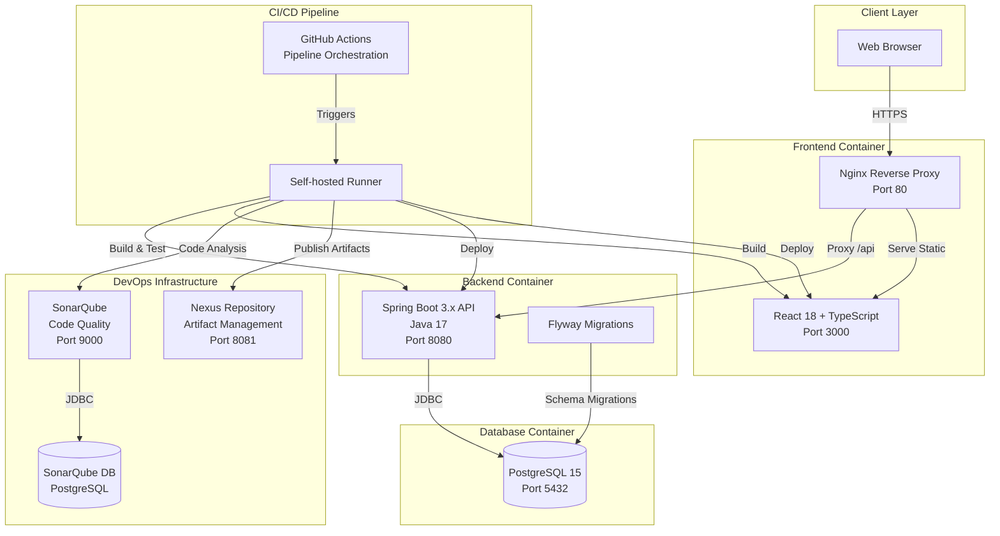
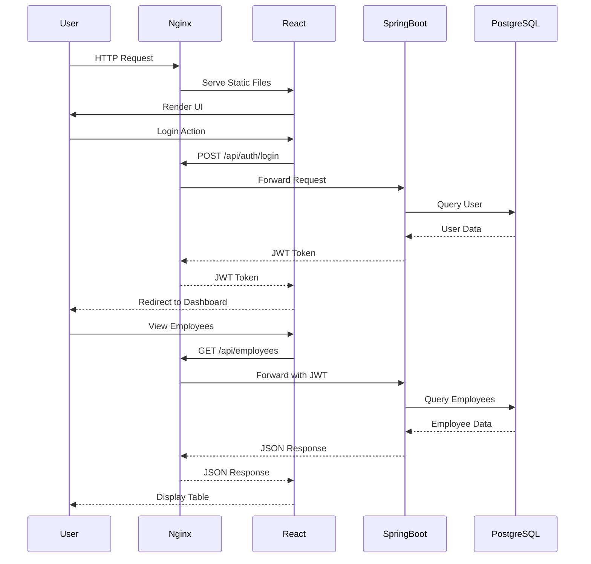
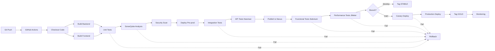
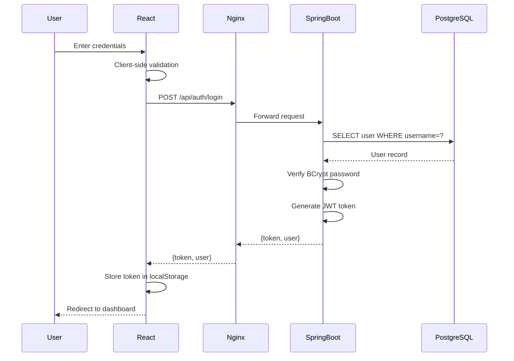
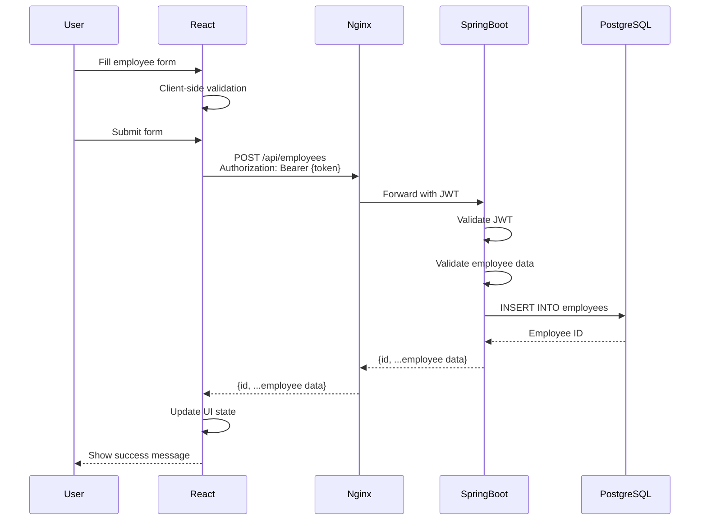
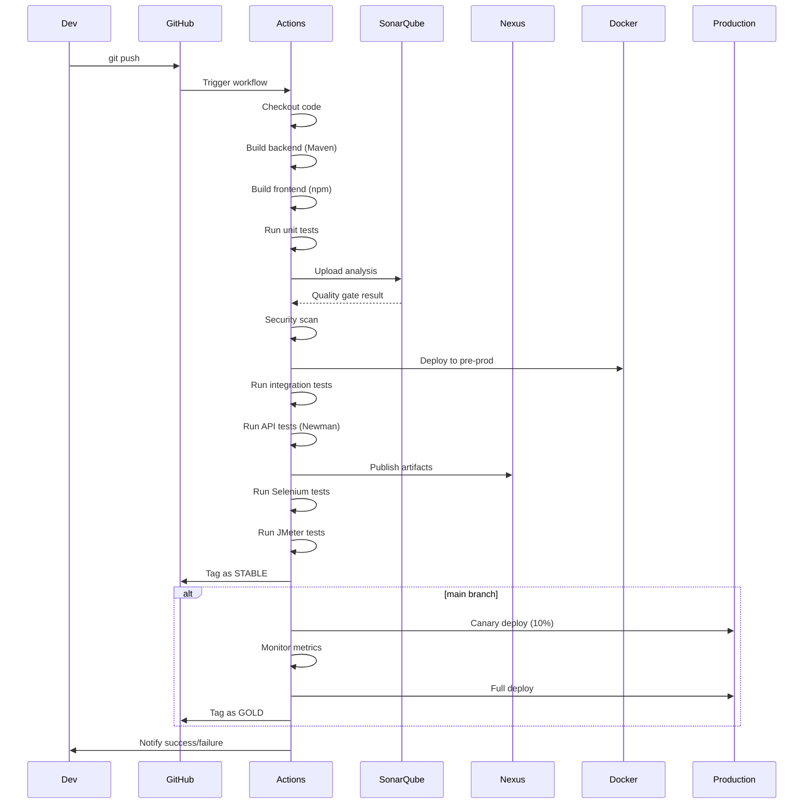
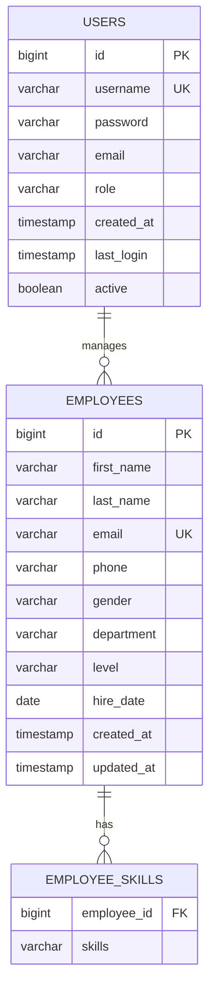

# Architecture Documentation - DevOps Enterprise Platform

## Table of Contents
1. [System Overview](#system-overview)
2. [Architecture Diagram](#architecture-diagram)
3. [Technology Stack](#technology-stack)
4. [Network Architecture](#network-architecture)
5. [Data Flow](#data-flow)
6. [Component Details](#component-details)

## System Overview

The DevOps Enterprise Platform is a full-stack web application demonstrating DevOps best practices, including automated CI/CD pipelines, containerized infrastructure, and comprehensive testing strategies. The system implements a complete employee management system with authentication and CRUD operations.

### Key Characteristics
- **Architecture Style:** Microservices-ready monolith with clear separation of concerns
- **Deployment Model:** Containerized with Docker
- **Infrastructure:** Infrastructure as Code using Docker Compose
- **CI/CD:** Fully automated pipeline with GitHub Actions
- **Testing:** Multi-level testing strategy (unit, integration, functional, performance)

## Architecture Diagram

### High-Level System Architecture



### Component Interaction Diagram



### CI/CD Pipeline Architecture



## Technology Stack

### Frontend Stack

| Component | Technology | Version | Purpose |
|-----------|-----------|---------|---------|
| **Framework** | React | 18.x | UI component library |
| **Language** | TypeScript | 5.x | Type-safe JavaScript |
| **Build Tool** | Vite | 5.x | Fast build and dev server |
| **UI Library** | Material-UI (MUI) | 5.x | Component library and design system |
| **Routing** | React Router | 6.x | Client-side routing |
| **HTTP Client** | Axios | 1.x | API communication |
| **Form Management** | React Hook Form | 7.x | Form state and validation |
| **Validation** | Yup | 1.x | Schema validation |
| **State Management** | React Context API | Built-in | Global state management |
| **Testing** | Vitest | 1.x | Unit testing framework |
| **Testing Library** | React Testing Library | 14.x | Component testing utilities |
| **Web Server** | Nginx | Alpine | Static file serving and reverse proxy |

### Backend Stack

| Component | Technology | Version | Purpose |
|-----------|-----------|---------|---------|
| **Language** | Java | 17 LTS | Programming language |
| **Framework** | Spring Boot | 3.x | Application framework |
| **Build Tool** | Maven | 3.9+ | Dependency management and build |
| **ORM** | Spring Data JPA | 3.x | Database abstraction |
| **Database Driver** | PostgreSQL JDBC | Latest | Database connectivity |
| **Migration Tool** | Flyway | 9.x | Database version control |
| **Security** | Spring Security | 6.x | Authentication and authorization |
| **JWT** | jjwt | 0.12.x | JWT token handling |
| **Validation** | Jakarta Validation | 3.x | Bean validation |
| **Lombok** | Lombok | 1.18.x | Boilerplate reduction |
| **Testing** | JUnit 5 | 5.x | Unit testing framework |
| **Mocking** | Mockito | 5.x | Test mocking |
| **Property Testing** | jqwik | 1.8.x | Property-based testing |
| **API Testing** | REST Assured | 5.x | Integration testing |

### Database

| Component | Technology | Version | Purpose |
|-----------|-----------|---------|---------|
| **RDBMS** | PostgreSQL | 15 | Primary data store |
| **Connection Pooling** | HikariCP | Built-in | Database connection management |

### DevOps Tools

| Component | Technology | Version | Purpose |
|-----------|-----------|---------|---------|
| **CI/CD** | GitHub Actions | Latest | Pipeline orchestration |
| **Containerization** | Docker | 20.10+ | Application containerization |
| **Orchestration** | Docker Compose | 2.x | Multi-container management |
| **Code Quality** | SonarQube | LTS Community | Static code analysis |
| **Artifact Repository** | Nexus Repository OSS | 3.x | Artifact management |
| **API Testing** | Postman + Newman | Latest | API test automation |
| **Functional Testing** | Selenium WebDriver | 4.x | Browser automation |
| **Performance Testing** | Apache JMeter | 5.6+ | Load and performance testing |
| **Coverage** | JaCoCo | 0.8.x | Java code coverage |
| **Coverage** | c8 | Latest | JavaScript code coverage |
| **Security Scanning** | OWASP Dependency Check | Latest | Vulnerability scanning |

### Development Tools

| Component | Technology | Purpose |
|-----------|-----------|---------|
| **Version Control** | Git | Source code management |
| **Repository** | GitHub | Code hosting and collaboration |
| **IDE** | IntelliJ IDEA / VS Code | Development environment |
| **API Client** | Postman | API testing and documentation |

## Network Architecture

### Port Mapping

| Service | Internal Port | External Port | Protocol | Purpose |
|---------|--------------|---------------|----------|---------|
| Frontend (Nginx) | 80 | 3000 | HTTP | Web UI access |
| Backend (Spring Boot) | 8080 | 8080 | HTTP | REST API |
| PostgreSQL (App DB) | 5432 | 5432 | TCP | Application database |
| SonarQube | 9000 | 9000 | HTTP | Code quality dashboard |
| SonarQube DB | 5432 | 5433 | TCP | SonarQube database |
| Nexus Repository | 8081 | 8081 | HTTP | Artifact repository |

### Docker Network Configuration

```yaml
networks:
  devops-network:
    driver: bridge
    ipam:
      config:
        - subnet: 172.20.0.0/16
```

**Network Isolation:**
- All containers communicate through the `devops-network` bridge network
- Services reference each other by container name (Docker DNS)
- External access only through exposed ports
- Database not exposed externally in production

### Communication Patterns

**Frontend ↔ Backend:**
- Protocol: HTTP/REST
- Format: JSON
- Authentication: JWT Bearer tokens
- Proxy: Nginx forwards `/api/*` to backend

**Backend ↔ Database:**
- Protocol: JDBC over TCP
- Connection Pool: HikariCP (max 10 connections)
- SSL: Enabled in production

**Pipeline ↔ Services:**
- SonarQube: REST API over HTTP
- Nexus: Maven Deploy Protocol
- Docker: Docker API over Unix socket

## Data Flow

### Authentication Flow



### CRUD Operation Flow (Create Employee)



### CI/CD Deployment Flow



## Component Details

### Frontend Components

#### React Application Structure
```
frontend/src/
├── components/          # Reusable UI components
│   ├── EmployeeForm.tsx       # Form for create/edit
│   ├── EmployeeTable.tsx      # Data table with sorting
│   ├── Navbar.tsx             # Navigation bar
│   ├── Layout.tsx             # Page layout wrapper
│   ├── PrivateRoute.tsx       # Route protection
│   ├── LoadingSpinner.tsx     # Loading indicator
│   ├── ErrorBoundary.tsx      # Error handling
│   └── Toast.tsx              # Notifications
├── pages/               # Page components
│   ├── LoginPage.tsx          # Authentication page
│   ├── EmployeeListPage.tsx   # Employee list view
│   └── EmployeeFormPage.tsx   # Employee create/edit
├── contexts/            # React Context providers
│   └── AuthContext.tsx        # Authentication state
├── services/            # API communication
│   ├── apiClient.ts           # Axios configuration
│   ├── authService.ts         # Auth API calls
│   └── employeeService.ts     # Employee API calls
├── types/               # TypeScript definitions
│   ├── auth.ts                # Auth types
│   └── employee.ts            # Employee types
└── utils/               # Utility functions
```

**Key Features:**
- Material-UI components for consistent design
- React Hook Form for form management
- Yup schemas for validation
- Axios interceptors for JWT injection
- Context API for global auth state

#### Nginx Configuration
- Serves static React build files
- Reverse proxy for `/api/*` to backend
- Gzip compression enabled
- Security headers configured
- SPA routing support (try_files)

### Backend Components

#### Spring Boot Application Structure
```
backend/src/main/java/com/techcorp/devops/
├── config/              # Configuration classes
│   ├── SecurityConfig.java    # Spring Security setup
│   └── CorsConfig.java        # CORS configuration
├── controller/          # REST controllers
│   ├── AuthController.java    # /api/auth/*
│   └── EmployeeController.java # /api/employees/*
├── service/             # Business logic
│   ├── AuthService.java
│   └── EmployeeService.java
├── repository/          # Data access
│   ├── UserRepository.java
│   └── EmployeeRepository.java
├── entity/              # JPA entities
│   ├── User.java
│   └── Employee.java
├── dto/                 # Data transfer objects
│   ├── LoginRequest.java
│   ├── AuthResponse.java
│   ├── EmployeeDTO.java
│   ├── EmployeeCreateDTO.java
│   └── EmployeeUpdateDTO.java
├── security/            # Security components
│   ├── JwtTokenProvider.java
│   ├── JwtAuthenticationFilter.java
│   └── UserDetailsServiceImpl.java
├── exception/           # Exception handling
│   ├── GlobalExceptionHandler.java
│   ├── EntityNotFoundException.java
│   └── ValidationException.java
└── DevOpsApplication.java # Main application class
```

**Key Features:**
- RESTful API design
- JWT-based authentication
- BCrypt password hashing
- JPA for database operations
- Flyway for schema migrations
- Global exception handling
- Bean validation
- Actuator endpoints for monitoring

### Database Schema

#### Entity Relationship Diagram



**Indexes:**
- `users.username` - Unique index for login
- `employees.email` - Unique index for validation
- `employees.department` - Index for filtering
- `employee_skills.employee_id` - Foreign key index

### DevOps Infrastructure

#### SonarQube
- **Purpose:** Static code analysis and quality gates
- **Database:** Dedicated PostgreSQL instance
- **Integration:** Maven plugin for backend, sonar-scanner for frontend
- **Quality Gates:** >80% coverage, no critical issues

#### Nexus Repository
- **Purpose:** Artifact storage and versioning
- **Repositories:**
  - Maven releases
  - Maven snapshots
  - npm hosted
  - Docker hosted
- **Integration:** Maven deploy plugin, npm publish

#### Docker Containers
- **Multi-stage builds:** Optimize image size
- **Non-root users:** Security best practice
- **Health checks:** Automated container monitoring
- **Volume mounts:** Data persistence
- **Resource limits:** CPU and memory constraints in production

## Security Architecture

### Authentication & Authorization
- **JWT Tokens:** Stateless authentication
- **BCrypt Hashing:** Password storage
- **Role-Based Access Control (RBAC):** User permissions
- **Token Expiration:** Configurable timeout
- **Secure Headers:** XSS, CSRF protection

### Network Security
- **Container Isolation:** Bridge network
- **Port Exposure:** Minimal external ports
- **Secrets Management:** GitHub Secrets, environment variables
- **HTTPS:** Nginx SSL termination (production)

### Application Security
- **Input Validation:** Client and server-side
- **SQL Injection Prevention:** JPA parameterized queries
- **XSS Prevention:** React automatic escaping
- **CSRF Protection:** Spring Security CSRF tokens
- **Dependency Scanning:** OWASP, npm audit

## Scalability Considerations

### Horizontal Scaling
- **Stateless Backend:** Can run multiple instances
- **Load Balancer:** Nginx can distribute traffic
- **Database Connection Pooling:** HikariCP manages connections
- **Session Management:** JWT tokens (no server-side sessions)

### Vertical Scaling
- **Resource Limits:** Configurable in Docker Compose
- **JVM Tuning:** Heap size configuration
- **Database Tuning:** PostgreSQL configuration

### Future Enhancements
- Kubernetes orchestration for multi-node deployment
- Redis for caching and session storage
- Message queue for async processing
- CDN for static assets
- Database read replicas

## Monitoring & Observability

### Application Monitoring
- **Spring Boot Actuator:** Health, metrics, info endpoints
- **Logs:** Structured logging with Logback
- **Metrics:** JVM metrics, HTTP metrics

### Infrastructure Monitoring
- **Docker Stats:** Container resource usage
- **Health Checks:** Automated container health monitoring
- **Database Monitoring:** PostgreSQL logs and metrics

### CI/CD Monitoring
- **Pipeline Metrics:** Build time, success rate
- **Test Results:** Coverage, pass rate
- **Quality Metrics:** SonarQube dashboard
- **Performance Metrics:** JMeter reports

---

**Document Version:** 1.0  
**Last Updated:** 2024  
**Maintained By:** DevOps Platform Squad
