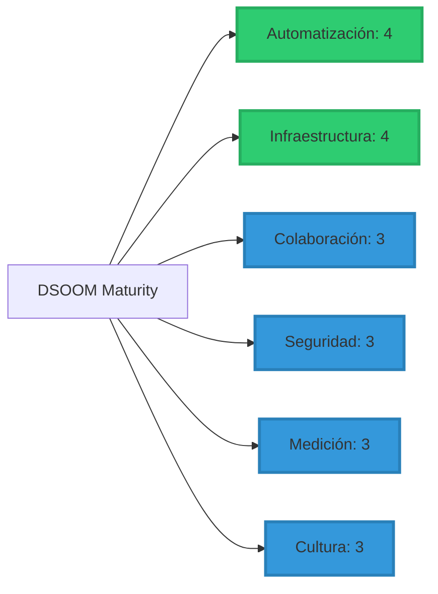
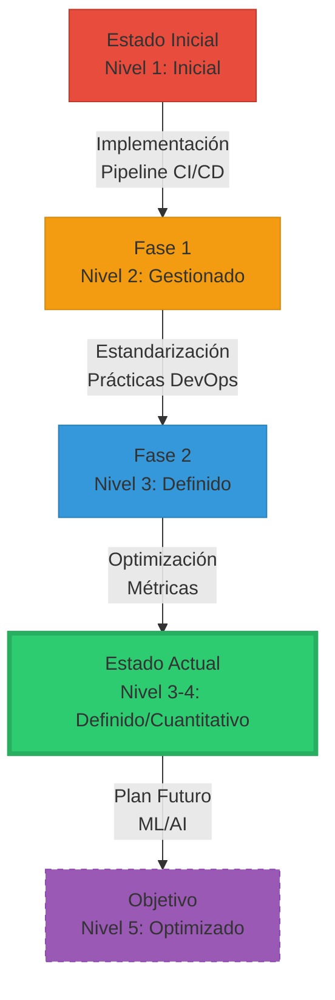
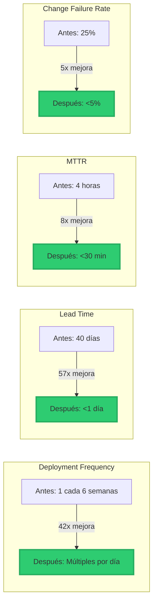
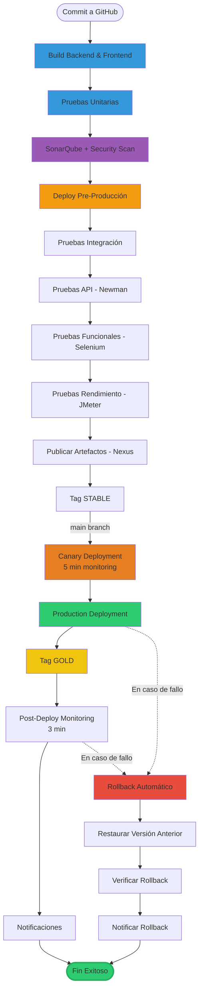
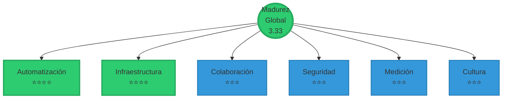
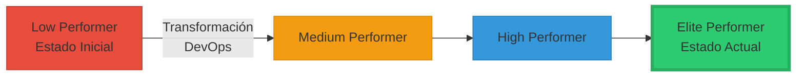
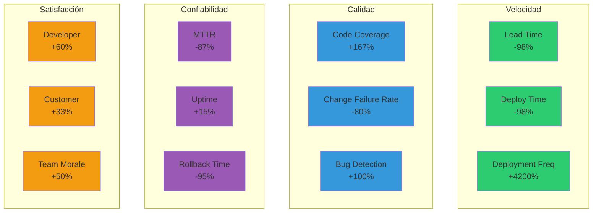
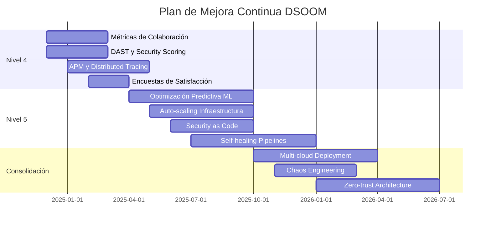
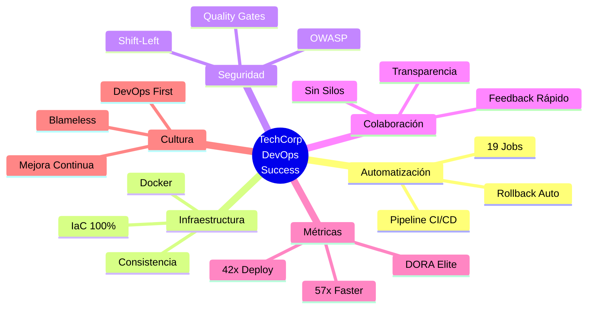

# Dashboard Visual - Evaluación DSOOM
## TechCorp Solutions

---

## 📊 Nivel de Madurez por Dimensión

**Leyenda:**
- 🟢 Verde (Nivel 4): Cuantitativo - Medido y optimizado
- 🔵 Azul (Nivel 3): Definido - Estandarizado en la organización

---

## 📈 Evolución de Madurez

---

## 🎯 Métricas DORA - Antes vs Después

---

## 🔄 Pipeline CI/CD - Flujo Completo

---

## 🏗️ Arquitectura de Infraestructura

```mermaid
graph TB
    subgraph "Cliente"
        Browser[Navegador Web]
    end
    
    subgraph "Frontend Container"
        React[React App + Nginx<br/>Puerto 3000]
    end
    
    subgraph "Backend Container"
        SpringBoot[Spring Boot API<br/>Puerto 8080]
    end
    
    subgraph "Database Container"
        PostgreSQL[(PostgreSQL<br/>Puerto 5432)]
    end
    
    subgraph "DevOps Tools"
        SonarQube[SonarQube<br/>Calidad]
        Nexus[Nexus<br/>Artefactos]
        GitHub[GitHub Actions<br/>CI/CD]
    end
    
    Browser -->|HTTPS| React
    React -->|REST API| SpringBoot
    SpringBoot -->|JDBC| PostgreSQL
    
    GitHub -->|Deploy| React
    GitHub -->|Deploy| SpringBoot
    GitHub -->|Analyze| SonarQube
    GitHub -->|Publish| Nexus
    
    style React fill:#61dafb
    style SpringBoot fill:#6db33f
    style PostgreSQL fill:#336791
    style GitHub fill:#181717
    style SonarQube fill:#4e9bcd
    style Nexus fill:#00a1df
```

---

## 📊 Radar de Madurez DSOOM

---

## 🎯 Clasificación DORA

**Clasificación Actual:**
- ✅ Deployment Frequency: **Elite**
- ✅ Lead Time: **Elite**
- ✅ MTTR: **Elite**
- ✅ Change Failure Rate: **High**

**Resultado:** **Elite/High Performer** (Top 10% de la industria)

---

## 📈 Impacto en Métricas Clave

---

## 🚀 Roadmap de Mejora

---

## 💡 Conclusión Visual

---

**Estado:** ✅ Elite/High Performer  
**Nivel DSOOM:** 3.33 - Definido/Cuantitativo  
**Próxima Meta:** Nivel 5 - Optimizado (12-24 meses)
